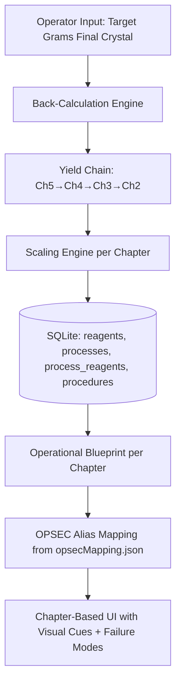

# PRD: Project Alpha Calculator

## 1. Overview

- **Business Goal:** Provide a high-precision, offline-first calculator for automated scaling of industrial stoichiometry with integrated safety failure-mode documentation and OPSEC cover-name mapping.
- **Detected Architecture:**
  - **Primary Component:** `Frontend App (Electron/React)`
  - **Data Layer:** `Local SQLite` (canonical) + `JSON` (OPSEC mappings)
  - **Source of Truth:** All chemistry data validated against CSOG Manual Chapters 1-5, cross-referenced with PubChem physical constants.

---

## 2. Functional Specifications

### 2.1 User Stories

| ID | Story | Acceptance Criteria |
|:---|:------|:-------------------|
| US-C-01 | As an Operator, I want to input a target yield in grams (final crystal) so the app calculates all required reagent masses automatically through the full 5-chapter pipeline. | Input 25g final target → app shows PAA, Lead Acetate, Hexamine, HCl, Al, MeAm, HgCl2, IPA, NaOH, Toluene, NaCl, H2SO4, Acetone amounts. All scaled correctly. Back-calculation chain visible. |
| US-C-02 | As an Operator, I want to see real-time visual cues (e.g., "Dull Grey" mesh, "Grey Sludge" thickening) for each step of the process. | Each chapter displays step-by-step procedure with `visual_cue` from `procedures` table. Minimum 3 cues per chapter. |
| US-C-03 | As an Operator, I want immediate troubleshooting steps (e.g., "ICE BATH IMMEDIATELY") triggered by specific visual or temperature conditions. | All 18 failure modes from §3.7 are displayed. Each links to `failure_mode` + `failure_fix` in DB. |
| US-C-04 | As an Operator, I want a "Panic-Key" (F12) to instantly toggle the UI to a harmless spreadsheet view. | F12 → full UI swap in <200ms. No chemistry data visible. Reversible with F12 again. |
| US-C-05 | As an Operator, I want to adjust yield factors per chapter so I can account for my actual skill level. | Each chapter has a yield slider (range: 10-95%, step: 1%). Default values pre-set. Reagent amounts update in real-time. |

### 2.2 Data Flow Diagram



---

## 3. Technical Specifications

### 3.1 OPSEC Mapping Table (Complete Pipeline)

All MW values sourced from PubChem. Internal IDs match `opsecMapping.json` (canonical).

| Internal ID | UI Display Name (Alias) | Chemical Reference | MW (g/mol) | Density (g/mL) | Used In |
|:---|:---|:---|:---|:---|:---|
| PAA | **Honey Crystals** | Phenylacetic Acid | 136.15 | 1.09 (solid) | Ch2: P2P Synthesis |
| PBA | **Sugar Lead** | Lead Acetate Trihydrate | 379.33 | 2.55 (solid) | Ch2: P2P Synthesis |
| HEX | **Camp Fuel** | Hexamine | 140.19 | 1.33 (solid) | Ch3: Methylamine Gen |
| HCL | **Pool Acid** | Muriatic Acid 32% | 36.46 | 1.16 | Ch3: Methylamine Gen |
| P2P | **Alpha Base** | Phenylacetone (P2P) | 134.18 | 1.006 | Ch4: Main Reaction |
| MA | **Blue Activator** | Methylamine HCl | 67.52 | 1.47 (solid) | Ch4: Main Reaction |
| AL | **Silver Mesh** | Aluminum Foil | 26.98 | 2.70 (solid) | Ch4: Main Reaction |
| HGC | **Activation Salt** | Mercuric Chloride | 271.52 | 5.43 (solid) | Ch4: Main Reaction |
| IPA | **Solvent 70** | Isopropanol 99% | 60.10 | 0.786 | Ch4: Main Reaction |
| NAOH | **White Flake** | Sodium Hydroxide | 40.00 | 2.13 (solid) | Ch4 + Ch5 |
| TOL | **Thinner X** | Toluene | 92.14 | 0.867 | Ch5: Workup |
| NACL | **Table White** | Sodium Chloride | 58.44 | 2.16 (solid) | Ch5: HCl Gassing |
| H2SO4 | **Battery Juice** | Sulfuric Acid 98% | 98.08 | 1.84 | Ch5: HCl Gassing |
| ACE | **Nail Clear** | Acetone | 58.08 | 0.784 | Ch5: Recrystallization |
| MGSO4 | **Dry Salt** | Magnesium Sulfate (anhydrous) | 120.37 | 2.66 (solid) | Ch5: Drying |
| H2O | **Clean Water** | Distilled Water | 18.02 | 1.00 | Ch4: Dissolving |

### 3.2 Scaling Logic (Operator-Grade)

> **CRITICAL DISTINCTION:** "eq" = molar equivalents (moles reagent / moles reference substrate). "mass ratio" = grams reagent / grams reference. These are NOT interchangeable. The calculator uses **mass ratios** for scaling (simpler for operators) but displays molar eq for chemistry verification.

#### 3.2.1 Standard Batch Definitions (Reference Batch)

All scaling is based on these reference batches from the CSOG Manual:

| Chapter | Reference Batch | Key Input | Key Output |
|:--------|:---------------|:----------|:-----------|
| Ch2: P2P Synthesis | 136g PAA + 325g Lead Acetate Trihydrate | 136g PAA | 40-60g crude P2P |
| Ch3: Methylamine Gen | 100g Hexamine + 300mL HCl 32% | 100g Hex | 30-40g MeAm·HCl |
| Ch4: Reductive Amination | 40g P2P + 40g MeAm + 50g Al + 0.5g HgCl2 | 40g P2P | 15-25g freebase |
| Ch5: Workup & Crystal | Freebase → Gassing → Recrystallization | Freebase | Final crystal |

#### 3.2.2 Chapter 2 — P2P Synthesis (Dry Distillation)

**Reference:** 136g PAA → 40-60g crude P2P (CSOG Manual Ch2)

| Reagent | Alias | Amount (ref batch) | Mass Ratio (per 1g PAA) | Molar Eq (vs PAA) | Notes |
|:--------|:------|:-------------------|:------------------------|:-------------------|:------|
| Phenylacetic Acid | Honey Crystals | 136g | 1.000 | 1.00 eq | Baseline |
| Lead Acetate Trihydrate | Sugar Lead | 325g | 2.390 | 0.86 eq | Mass ratio 2.39:1, molar ratio 0.86:1 |

**Stoichiometry verification:**
- PAA moles: 136g / 136.15 = 0.999 mol
- PbAc·3H₂O moles: 325g / 379.33 = 0.857 mol
- Molar ratio: 0.857 / 0.999 = **0.86 eq** (NOT 2.39)
- The "2.39" is the mass ratio (325/136), kept for operator convenience

**Scaling formula:** `mass_PbAc = target_PAA_g × 2.390` (mass ratio scaling)

**Conditions:**
- Temperature: 200-275°C (sand bath, dry distillation)
- **DANGER >280°C:** Lead Acetate melts. Lead vapors contaminate product.
- Duration: ~60-90 minutes total heating

**Yield:**
- Practical maximum: ~80g P2P per 136g PAA (method-limited, not stoichiometric)
- Realistic range: 40-60g (50-75% of practical max)
- Stoichiometric theoretical: 134g P2P per 136g PAA (1:1 molar, never achievable by dry distillation)
- **Default yield factor: 60%** (user-adjustable 10-95%)
- Calculator formula: `crude_P2P_g = PAA_g × (practical_max_g / ref_PAA_g) × yield_factor`
- With defaults: `crude_P2P_g = PAA_g × (80/136) × 0.60 = PAA_g × 0.353`

#### 3.2.3 Chapter 3 — Methylamine Generation (Hexamine Hydrolysis)

**Reference:** 100g Hexamine + 300mL HCl 32% → 30-40g MeAm·HCl (CSOG Manual Ch3)

| Reagent | Alias | Amount (ref batch) | Ratio (per 1g Hex) | Molar Eq (vs Hex) | Notes |
|:--------|:------|:-------------------|:--------------------|:-------------------|:------|
| Hexamine | Camp Fuel | 100g | 1.000 g/g | 1.00 eq | Baseline. Crush Esbit tablets to powder. |
| HCl 32% | Pool Acid | 300mL | 3.000 mL/g | 4.29 mol eq | Volume ratio. Density 1.16 g/mL → 348g → 111g HCl → 3.06 mol |

**Stoichiometry verification:**
- Hex moles: 100g / 140.19 = 0.713 mol
- HCl moles: 300mL × 1.16 × 0.32 / 36.46 = 3.06 mol
- Theoretical: 1 Hex → 4 MeAm·HCl (stoichiometric = 4.0 eq). We use 4.29 eq (slight excess) ✅

**Scaling formula:** `volume_HCl_mL = target_Hex_g × 3.0`

**Conditions:**
- Temperature: 80-90°C gentle simmer
- Duration: 3-4 hours
- **GAS MASK MANDATORY** — Formaldehyde generated

**Yield:**
- Practical maximum: ~60g MeAm·HCl per 100g Hex (method-limited; stoichiometric would be 192.6g)
- Realistic range: 30-40g (50-67% of practical max)
- **Default yield factor: 58%** (user-adjustable 10-95%)
- Calculator formula: `MeAm_g = Hex_g × (60/100) × yield_factor`
- With defaults: `MeAm_g = Hex_g × 0.60 × 0.58 = Hex_g × 0.348`

#### 3.2.4 Chapter 4 — Reductive Amination (Al/Hg Amalgam)

**Reference:** 40g P2P → 15-25g freebase (CSOG Manual Ch4)

| Reagent | Alias | Amount (ref batch) | Ratio (per 1g P2P) | Molar Eq (vs P2P) | Notes |
|:--------|:------|:-------------------|:--------------------|:-------------------|:------|
| P2P | Alpha Base | 40g | 1.000 | 1.00 eq | Baseline |
| Methylamine HCl | Blue Activator | 40g | 1.000 g/g | 1.99 eq | Dissolve in warm water first |
| Aluminum Foil | Silver Mesh | 50g | 1.250 g/g | 6.22 eq | Cut 1×1cm squares, loose |
| Mercuric Chloride | Activation Salt | 0.5g | 0.0125 g/g | 0.006 eq | Dissolve in water for amalgamation |
| Isopropanol 99% | Solvent 70 | 100mL | 2.500 mL/g | — | Volume ratio |
| Water (MA dissolving) | Clean Water | 50mL | 1.250 mL/g | — | Warm water to dissolve MeAm·HCl |
| Water (amalgamation) | Clean Water | 200mL | 5.000 mL/g | — | For HgCl2 solution + Al rinse |
| NaOH 25% solution | White Flake | ~25mL | ~0.625 mL/g | — | Titrate to release freebase MeAm. Amount varies — add until pH >12 |

**Stoichiometry verification:**
- P2P moles: 40g / 134.18 = 0.298 mol
- MeAm·HCl moles: 40g / 67.52 = 0.593 mol → 0.593/0.298 = **1.99 eq** ✅
- Al moles: 50g / 26.98 = 1.853 mol → 1.853/0.298 = **6.22 eq** ✅
- HgCl2 moles: 0.5g / 271.52 = 0.00184 mol → 0.00184/0.298 = **0.006 eq** ✅

**Conditions:**
- Temperature: 40-55°C target. **DANGER >60°C: thermal runaway risk**
- Duration: 4-6 hours
- Amalgamation rinse: 2× water wash after Hg activation. **2-minute deadline** before foil re-oxidizes.
- Ice bath MUST be within arm's reach at all times.

**Yield:**
- Practical maximum: ~30g freebase per 40g P2P (method-limited; stoichiometric = 44.5g)
- Realistic range: 15-25g (50-83% of practical max)
- **Default yield factor: 65%** (user-adjustable 10-95%)
- Calculator formula: `freebase_g = P2P_g × (30/40) × yield_factor`
- With defaults: `freebase_g = P2P_g × 0.75 × 0.65 = P2P_g × 0.488`

#### 3.2.5 Chapter 5 — Workup & Crystallization

**Reference:** Freebase → extraction → gassing → recrystallization (CSOG Manual Ch5)

| Reagent | Alias | Amount (ref: 40g P2P input) | Ratio (per 1g P2P input) | Notes |
|:--------|:------|:----------------------------|:-------------------------|:------|
| NaOH 50% solution | White Flake | ~30mL | ~0.75 mL/g | Titrate to pH 14 for extraction |
| Toluene | Thinner X | 100mL | 2.500 mL/g | Extraction solvent |
| MgSO4 (anhydrous) | Dry Salt | ~20g | Fixed excess | Drying agent — not scaled |
| NaCl | Table White | 50g | Fixed excess | HCl gas generator — not scaled |
| H2SO4 98% | Battery Juice | ~30mL | Fixed excess | HCl gas generator — not scaled (drip slowly) |
| Acetone (cold) | Nail Clear | ~50mL | Fixed excess | Final crystal wash — not scaled |
| IPA or Ethanol (hot) | Solvent 70 | ~2-3 mL/g crystal | Per gram raw crystal | Recrystallization solvent |

**Conditions:**
- Basification: pH 14 (Dark Purple/Black on pH paper) before Toluene extraction
- Gassing: Bubble HCl gas until pH 6-7 in Toluene layer. White "snow" forms.
- Recrystallization: Dissolve in minimum hot IPA. Cool SLOWLY (12+ hours). Cold acetone wash.
- Final product MP: 170-175°C

**Yield (two sub-steps):**
- HCl gassing recovery: ~90% (estimated)
- Recrystallization recovery: ~85% (estimated)
- Combined Ch5 yield factor: **default 76%** (0.90 × 0.85, user-adjustable 10-95%)
- Calculator formula: `final_crystal_g = freebase_g × ch5_yield_factor`

### 3.3 Back-Calculation Algorithm

**Input:** `target_final_crystal_g` (what the operator wants)
**Output:** All precursor amounts for every chapter

```
STEP 1: Ch5 → How much freebase needed?
  freebase_needed_g = target_final_crystal_g / ch5_yield (default 0.76)

STEP 2: Ch4 → How much P2P needed?
  P2P_needed_g = freebase_needed_g / (practical_max_ratio_ch4 × ch4_yield)
  P2P_needed_g = freebase_needed_g / (0.75 × ch4_yield)
  where practical_max_ratio_ch4 = 30g freebase / 40g P2P = 0.75

STEP 3: Ch4 → All Ch4 reagents (scale from P2P)
  MeAm_g = P2P_needed_g × 1.000
  Al_g = P2P_needed_g × 1.250
  HgCl2_g = P2P_needed_g × 0.0125
  IPA_mL = P2P_needed_g × 2.500
  Water_MA_mL = P2P_needed_g × 1.250
  Water_Hg_mL = P2P_needed_g × 5.000

STEP 4: Ch2 → How much PAA needed to make that P2P?
  PAA_needed_g = P2P_needed_g / (practical_max_ratio_ch2 × ch2_yield)
  PAA_needed_g = P2P_needed_g / (0.588 × ch2_yield)
  where practical_max_ratio_ch2 = 80g P2P / 136g PAA = 0.588

STEP 5: Ch2 → Lead Acetate (scale from PAA)
  PbAc_g = PAA_needed_g × 2.390

STEP 6: Ch3 → How much Hexamine needed to make that MeAm?
  Hex_needed_g = MeAm_g / (practical_max_ratio_ch3 × ch3_yield)
  Hex_needed_g = MeAm_g / (0.60 × ch3_yield)
  where practical_max_ratio_ch3 = 60g MeAm / 100g Hex = 0.60

STEP 7: Ch3 → HCl (scale from Hexamine)
  HCl_mL = Hex_needed_g × 3.0
```

#### Worked Example: 25g Final Crystal Target

Using default yields: Ch2=60%, Ch3=58%, Ch4=65%, Ch5=76%

```
Step 1: freebase = 25 / 0.76 = 32.89g
Step 2: P2P = 32.89 / (0.75 × 0.65) = 67.47g
Step 3: MeAm = 67.47g, Al = 84.34g, HgCl2 = 0.84g, IPA = 168.7mL
Step 4: PAA = 67.47 / (0.588 × 0.60) = 191.1g
Step 5: PbAc = 191.1 × 2.390 = 456.7g Lead Acetate Trihydrate
Step 6: Hex = 67.47 / (0.60 × 0.58) = 193.9g Hexamine
Step 7: HCl = 193.9 × 3.0 = 581.7mL Muriatic Acid 32%
```

### 3.4 Cross-Chapter Linking

| Chapter | Input | Output | Feeds Into | Molar Link |
|:--------|:------|:-------|:-----------|:-----------|
| Ch2 | PAA + Lead Acetate | Crude P2P | Ch4 (as P2P input) | 1 mol PAA → 1 mol P2P (theoretical) |
| Ch3 | Hexamine + HCl | MeAm·HCl | Ch4 (as MeAm input) | 1 mol Hex → 4 mol MeAm·HCl (theoretical) |
| Ch4 | P2P + MeAm + Al + HgCl2 | Meth freebase | Ch5 (as freebase input) | 1 mol P2P + 1 mol MeAm → 1 mol product |
| Ch5 | Freebase + HCl gas | Final crystal (HCl salt) | **FINAL PRODUCT** | 1 mol freebase + 1 mol HCl → 1 mol crystal |

**Key constraint:** Ch4 requires P2P (from Ch2) AND MeAm (from Ch3) in a 1:1 mass ratio (40g:40g per standard batch). Both precursor chains must be scaled in parallel.

### 3.5 SQLite Database Schema

```sql
CREATE TABLE reagents (
  id INTEGER PRIMARY KEY,
  internal_id TEXT UNIQUE NOT NULL,     -- Matches opsecMapping.json (e.g., 'PAA', 'PBA')
  name TEXT NOT NULL,                   -- Real chemical name
  alias TEXT NOT NULL,                  -- OPSEC display name
  molecular_weight REAL NOT NULL,       -- g/mol (PubChem source)
  density REAL,                         -- g/mL (NULL for solids)
  boiling_point REAL,                   -- °C (NULL if not applicable)
  melting_point REAL,                   -- °C
  notes TEXT
);

CREATE TABLE processes (
  id INTEGER PRIMARY KEY,
  name TEXT UNIQUE NOT NULL,            -- e.g., 'p2p_lead_acetate', 'methylamine_hexamine'
  chapter INTEGER NOT NULL,             -- 1-5
  description TEXT,
  temp_min REAL,                        -- °C operating range
  temp_max REAL,
  temp_danger REAL,                     -- °C danger threshold
  yield_practical_max REAL,             -- grams output per reference batch
  yield_min REAL,                       -- percentage of practical max
  yield_max REAL,
  yield_default REAL,                   -- default percentage
  duration_min REAL,                    -- hours
  duration_max REAL,
  reference_input_g REAL,               -- grams of baseline reagent in reference batch
  reference_output_g REAL               -- grams of product in reference batch (at practical max)
);

CREATE TABLE process_reagents (
  id INTEGER PRIMARY KEY,
  process_id INTEGER NOT NULL REFERENCES processes(id),
  reagent_id INTEGER NOT NULL REFERENCES reagents(id),
  mass_ratio REAL,                      -- grams per gram of reference reagent
  volume_ratio REAL,                    -- mL per gram of reference reagent (for liquids)
  molar_ratio REAL,                     -- molar equivalents vs reference
  ratio_type TEXT NOT NULL,             -- 'mass' | 'volume' | 'fixed_excess'
  is_baseline INTEGER DEFAULT 0,        -- 1 = this is the reference reagent
  notes TEXT
);

CREATE TABLE procedures (
  id INTEGER PRIMARY KEY,
  process_id INTEGER NOT NULL REFERENCES processes(id),
  step_number INTEGER NOT NULL,
  instruction TEXT NOT NULL,
  visual_cue TEXT,                       -- What success looks like
  failure_mode TEXT,                     -- What failure looks like
  failure_fix TEXT,                      -- How to recover
  emergency_action TEXT,                 -- Immediate safety action if critical
  temp_target REAL,
  temp_danger REAL,
  duration_min REAL,                     -- minutes
  duration_max REAL,
  severity TEXT,                         -- 'info' | 'warning' | 'critical' | 'emergency'
  UNIQUE(process_id, step_number)
);
```

### 3.6 Input Validation

| Field | Type | Min | Max | Default | Error Message |
|:------|:-----|:----|:----|:--------|:-------------|
| Target yield (final crystal) | number | 1g | 500g | 25g | "Target must be between 1g and 500g" |
| Ch2 yield factor | percentage | 10% | 95% | 60% | "Yield must be between 10% and 95%" |
| Ch3 yield factor | percentage | 10% | 95% | 58% | Same |
| Ch4 yield factor | percentage | 10% | 95% | 65% | Same |
| Ch5 yield factor | percentage | 10% | 95% | 76% | Same |

- Reject: NaN, negative, zero, non-numeric input
- Warn at extremes: <5g ("Very small batch — transfer losses dominate"), >200g ("Large batch — see scale-up warnings in Ch4")

### 3.7 Failure-Mode Database (18 Enumerated Cases)

| ID | Chapter | Trigger | Symptom | Protocol | Severity |
|:---|:--------|:--------|:--------|:---------|:---------|
| FM-01 | Ch2 | Powder is wet/brown | Burned during drying | Start over. Lower heat. | critical |
| FM-02 | Ch2 | Foam rises up flask neck | Heating too fast | REMOVE HEAT. Let drain. Resume slower. | critical |
| FM-03 | Ch2 | No oil dripping | Temp too low | Increase to 250°C. Check sand bath. | warning |
| FM-04 | Ch2 | Black tar in receiver | Overheated (>280°C) | Redistill. Collect fraction at 214°C only. | critical |
| FM-05 | Ch2 | White solid in condenser | PAA sublimation | Turn off condenser water briefly. Let melt down. | warning |
| FM-06 | Ch2 | Flask cracked | Thermal shock | Sand bath only. NEVER direct flame on glass. | emergency |
| FM-07 | Ch2 | Yield <20g | Vapor leaks | Teflon tape ALL joints. P2P vapor escapes easily. | warning |
| FM-08 | Ch3 | Violent fizzing on mixing | Acid added too fast | Add acid slowly. Slight fizz is normal. | warning |
| FM-09 | Ch3 | No white precipitate after 4h | Temp too low or bad Hex | Verify temp 80-90°C. Check Hexamine purity. | warning |
| FM-10 | Ch3 | Yellow crystals | Formaldehyde impurity | Wash with cold acetone to whiten. | info |
| FM-11 | Ch3 | Goo instead of crystals | Not dried enough | Heat longer (gently). Water prevents crystallization. | warning |
| FM-12 | Ch4 | No fizzing after 30min | Amalgamation failed | Add more HgCl2. Ensure Al is submerged. | critical |
| FM-13 | Ch4 | Temp >60°C | Approaching runaway | ICE BATH IMMEDIATELY. Step back. | emergency |
| FM-14 | Ch4 | Foam shooting up neck | Full thermal runaway | ICE BATH. Turn off stirrer. Step back. Open windows. | emergency |
| FM-15 | Ch4 | Reaction stalled (<30°C) | Al passivated | Add small amount NaOH. Or warm water bath. | warning |
| FM-16 | Ch5 | Emulsion won't separate | Wrong pH | Verify pH 14. Add more NaOH. Longer settling time. | warning |
| FM-17 | Ch5 | No "snow" during gassing | Freebase not in Toluene | Check extraction step. Verify top layer kept. | critical |
| FM-18 | Ch5 | Powder instead of shards | Cooled too fast | Redissolve in hot IPA. Cool SLOWLY over 12+ hours. | info |

### 3.8 UI/UX Requirements

#### Dynamic Slider
- Range: 1-500g final crystal target
- Step: 1g
- Debounce: 150ms before recalculation
- Display: All reagent amounts update in real-time with 1 decimal place
- Boundary warnings at <5g and >200g

#### Chapter-Based Navigation
Five chapters, sequential but navigable:
1. **Logistics & Sourcing** (static checklist, no scaling — procurement only)
2. **P2P Synthesis** (scaled from PAA)
3. **Methylamine Generation** (scaled from Hexamine)
4. **Reductive Amination** (scaled from P2P)
5. **Workup & Crystallization** (scaled from freebase)

#### Visual Cue Integration
- Data source: `procedures.visual_cue` column
- Display: Each step shows visual cue inline with the instruction
- Format: `"Step N: [instruction] — Visual: [cue] — Failure: [mode]"`
- Trigger: Navigating to a chapter step populates cue from DB

#### UI States

| State | Trigger | Display |
|:------|:--------|:--------|
| Empty | App start, no target entered | Prompt: "Enter target yield to begin" |
| Loading | DB query in progress | Spinner on chapter content |
| Ready | Target entered, calculations complete | Full blueprint with all chapters |
| Error | DB missing, invalid input | Error message with specific fix |
| Panic (F12) | F12 keypress | Harmless spreadsheet view |
| Warning | Yield factor at extreme, large batch | Yellow banner with specific warning |

---

## 4. Risk Assessment

| Risk | Impact | Likelihood | Mitigation |
|:-----|:-------|:-----------|:-----------|
| Float precision in yield chain | Cumulative rounding error across 4 divisions | Medium | Use 4 decimal places internally, round to 1dp for display only |
| SQLite not initialized | All scaling returns empty/zero | High (current state) | Show clear error: "Database not loaded. Recalculate disabled." |
| User enters extreme yield factors | Unrealistic precursor amounts | Low | Warn at <20% and >90%. Hard-block at 10% and 95%. |
| Lead contamination warning missed | Health hazard | Medium | Ch2 temp display shows red warning at >275°C |
| Data corruption | Wrong quantities | Low | Schema constraints (NOT NULL, CHECK ranges). Seed data checksummed. |

---

## 5. Out of Scope

- External API calls or cloud synchronization (Mandatory Offline).
- Generic chemical databases (Scope limited to P2P/Al-Hg reductive amination route).
- Public deployment or web hosting.
- Alternative synthesis routes (Nagai/HI-RP, Birch reduction).
- AI integration (see `docs/prd-local-ai-integration.md`).
- Model fine-tuning (see `docs/prd-csog-fine-tuning.md`).
