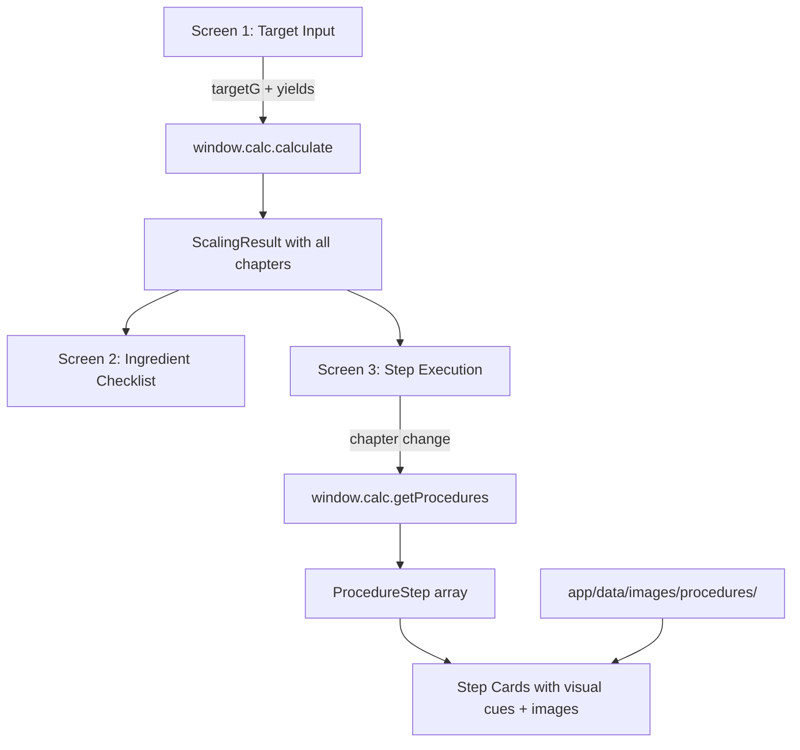

# PRD: Project Alpha — UI/UX Design System & Visual Specification

## 1. Overview

- **Business Goal:** Transform the existing functional-but-basic Calculator UI into a production-grade, beginner-friendly visual experience that guides operators through the full 5-chapter synthesis pipeline with auto-scaling quantities, inline visual cues, reference images, real-time safety monitoring, and professional dark-mode aesthetics.
- **Detected Architecture:**
  - **Primary Component:** `Frontend App (Electron/React)` — enhancement of existing Calculator components
  - **Technology:** React 18, TailwindCSS v4, Lucide icons, Vite, Electron 31
  - **Data Sources:** SQLite (via `window.calc` IPC) + `opsecMapping.json` + local image assets
  - **Parent PRD:** `docs/prd-project-alpha-calculator.md` (scaling logic, back-calculation, failure modes)
  - **Existing Code:** 6 Calculator components + `useCalculator` hook + panic mode already implemented

### 1.1 Design Philosophy

**Target aesthetic:** Notion's clean minimalism meets Thermo Fisher's lab instrument precision — elevated with Bloomberg Terminal's information density discipline and Linear's motion language.

#### Core Principles

| Principle | Description |
|:----------|:------------|
| **Beginner-first** | A first-time operator with zero chemistry knowledge can follow every step by reading the screen. Progressive disclosure — show essentials first, details on demand. |
| **Safety-visible** | Warnings, failure modes, and emergency actions are never hidden — always inline, always color-coded. Safety elements use **additive visual weight** (border + bg tint + icon + text label) so they remain prominent even under peripheral vision. |
| **Quantity-accurate** | Every number comes from the scaling engine (PRD §3.3). Zero hardcoded placeholder quantities. Monospace numerals with tabular alignment for scanability. |
| **Dark-mode primary** | Deep navy/charcoal reduces eye strain during long sessions. Light-mode only appears in panic overlay. Uses **luminance stepping** (not shadows) for depth — mimicking OLED-optimized interfaces. |
| **OPSEC-default** | UI displays alias names only. Real chemical names never shown in the Calculator UI. |
| **Spatial consistency** | Every layout decision follows the 8px grid. Padding, margins, and gaps are always multiples of 4px or 8px — never arbitrary values. |
| **Purposeful motion** | Animations exist to communicate state changes and guide attention — never for decoration. Every animation has a clear *intent* documented alongside its *spec*. |

#### Visual Identity Pillars

| Pillar | Implementation |
|:-------|:---------------|
| **Depth through luminance** | 6-level surface elevation model using brightness steps (`#06080C` → `#1A2233`), not drop shadows. Floating elements add `backdrop-filter: blur()` for frosted-glass separation. |
| **Color as function** | Color is never decorative. Every hue maps to a semantic role: blue=action, green=success/safe, amber=warning, red=danger, purple=learning. Neutral greys carry all non-semantic content. |
| **Typography hierarchy** | Two font families create clear separation: Inter for prose/UI, JetBrains Mono for data/quantities. Weight and size alone establish hierarchy — no underlines, no italics for emphasis. |
| **Restrained density** | Maximum 3 levels of visual nesting visible at any time. Cards never contain cards that contain cards. Content breathes with generous `line-height: 1.7` for instructional text. |

### 1.2 What This PRD Covers vs Parent PRD

| Concern | Covered In |
|:--------|:-----------|
| Back-calculation algorithm, stoichiometry, yield factors | `prd-project-alpha-calculator.md` §3.2–§3.3 |
| SQLite schema, seed data, scaling engine | `prd-project-alpha-calculator.md` §3.5 |
| Failure mode database (18 cases) | `prd-project-alpha-calculator.md` §3.7 |
| **Visual design, color system, typography, spacing** | **This PRD** |
| **Screen layouts, component specs, interaction design** | **This PRD** |
| **Visual assets (reference photos, diagrams)** | **This PRD** |
| **Persistent widgets (temp monitor, timer, emergency stop)** | **This PRD** |
| **Ingredient checklist screen** | **This PRD** |

---

## 2. Functional Specifications

### 2.1 User Stories

| ID | Story | Acceptance Criteria |
|:---|:------|:-------------------|
| US-UI-01 | As a beginner Operator, I want a clear onboarding screen where I enter my target yield so I understand exactly what I'm configuring before calculations begin. | Full-screen centered card with giant number input, helper tips, Taglish description. Single CTA to proceed. |
| US-UI-02 | As an Operator, I want an ingredient checklist grouped by chapter so I can shop for everything before starting any chemistry. | Screen 2: all 16 reagents listed with alias, scaled amount, sourcing info, and checkboxes. Progress counter. |
| US-UI-03 | As an Operator, I want each procedure step to show a reference image of what success/failure looks like so I can visually confirm I'm on track. | Each step card displays inline image (or diagram fallback), visual cue card, failure mode card. Minimum 3 images per chapter. |
| US-UI-04 | As an Operator, I want a persistent temperature monitor and reaction timer visible during Chapter 4 so I can track the most dangerous phase without scrolling. | Floating widgets: temp monitor (color-coded by range), timer with pause/reset. Always visible during Ch4. |
| US-UI-05 | As an Operator, I want an emergency stop button always visible so I can instantly see safety actions if something goes wrong. | Full-width red bar at bottom of screen. Click opens emergency overlay with chemical-specific first aid. Never hidden by scrolling. |
| US-UI-06 | As an Operator, I want color-coded severity on every step (info/warning/critical/emergency) so I know which steps need extra attention. | Timeline dots: blue=info, amber=warning, orange=critical, red+pulse=emergency. Matching card borders. |
| US-UI-07 | As an Operator, I want pro tips (purple cards) for key steps so I learn the "why" behind each action, not just the "what." | At least 5 pro tips across all chapters. Purple-tinted cards with 💡 icon. |

### 2.2 Screen Map

```
┌─────────────────────────────────────────────────────────┐
│                    SCREEN 1                              │
│              Target Yield Input                          │
│            (Onboarding / Landing)                        │
│                                                         │
│  "Gaano karaming [product] ang gagawin mo?"             │
│                                                         │
│              [  250  ] grams                             │
│                                                         │
│         [ Calculate My Ingredients → ]                  │
└─────────────────────┬───────────────────────────────────┘
                      │
                      ▼
┌──────────┬──────────────────────────────────────────────┐
│          │           SCREEN 2                            │
│ Sidebar  │    Ingredient Preparation Checklist           │
│          │                                               │
│ Ch1 ✓    │  Grouped by chapter. Checkbox per reagent.    │
│ Ch2 ●    │  Shows: alias, amount, MW, source info.       │
│ Ch3      │  Cost estimate. Progress counter.             │
│ Ch4      │                                               │
│ Ch5      │  [ All Ready → Start Chapter 2 ]              │
│          │                                               │
└──────────┴──────────┬───────────────────────────────────┘
                      │
                      ▼
┌──────────┬──────────────────────────────────────────────┐
│          │           SCREEN 3                            │
│ Sidebar  │    Step-by-Step Execution                     │
│          │                                               │
│ Ch1 ✓    │  Progress bar + Timer                         │
│ Ch2 ✓    │  [Step Card]                                  │
│ Ch3 ✓    │    ├─ Instruction                             │
│ Ch4 ●    │    ├─ 📷 Reference Image                     │
│ Ch5      │    ├─ 👁 Visual Cue (green)                  │
│          │    ├─ ⚠️ Failure Mode (amber)                │
│          │    ├─ 🚨 Emergency (red, pulse)               │
│          │    └─ 💡 Pro Tip (purple)                     │
│          │                                               │
│          │  [Temp Monitor]  [Timer]  [Emergency Stop]    │
└──────────┴──────────────────────────────────────────────┘

┌─────────────────────────────────────────────────────────┐
│                    SCREEN 4                              │
│                 Panic Mode (F12)                          │
│                                                         │
│  White background. Corporate finance spreadsheet.        │
│  Zero chemistry content visible. F12 to return.          │
└─────────────────────────────────────────────────────────┘
```

### 2.3 Data Flow (UI-specific)



---

## 3. Design System

### 3.1 Color Tokens

#### Surface & Background Palette

These form the luminance-stepping depth model. Each level adds ~3-5% perceived brightness.

| Token | Hex | Luminance | Usage | WCAG vs `text-primary` |
|:------|:----|:----------|:------|:-----------------------|
| `bg-primary` | `#06080C` | ~3% | App background (already in `index.css`) | 15.8:1 ✅ AAA |
| `bg-deep` | `#080B10` | ~4% | Sidebar background, recessed panels | 15.1:1 ✅ AAA |
| `bg-surface` | `#0B0F15` | ~6% | Cards, panels — default content surface | 14.2:1 ✅ AAA |
| `bg-elevated` | `#111620` | ~9% | Hover states, active icon containers | 12.6:1 ✅ AAA |
| `bg-raised` | `#161C28` | ~11% | Focused inputs, selected sidebar item bg | 11.1:1 ✅ AAA |
| `bg-float` | `#1A2233` | ~13% | Tooltips, floating widgets, dropdown menus | 10.0:1 ✅ AAA |

#### Border & Divider Palette

| Token | Hex | Usage |
|:------|:----|:------|
| `border-default` | `#141920` | Card borders — 1px, default state |
| `border-subtle` | `#1A2030` | Dividers, section separators, inactive borders |
| `border-focus` | `#151B25` | Input borders — resting state |
| `border-hover` | `#2A3040` | Input/card borders — hover state (brightened) |
| `border-active` | `#4C9EFF33` | Active/focus-visible ring — 20% opacity blue |

#### Text Palette

| Token | Hex | Contrast vs `bg-surface` | Usage |
|:------|:----|:-------------------------|:------|
| `text-primary` | `#E8ECF2` | 14.2:1 ✅ AAA | Headings, amounts, primary content |
| `text-secondary` | `#8A95A8` | 6.1:1 ✅ AA | Labels, descriptions, secondary info |
| `text-muted` | `#4A5568` | 3.2:1 ✅ AA-large | Hints, metadata, helper text (≥16px only) |
| `text-dim` | `#1E2530` | 1.4:1 ⚠️ decorative only | Barely visible — F12 hints, watermarks |

#### Accent Palette (Semantic)

Every accent color maps to exactly one semantic role. Never mix roles.

| Token | Hex | Semantic Role | Companion BG (4-6% tint) |
|:------|:----|:-------------|:--------------------------|
| `accent-blue` | `#4C9EFF` | **Action** — primary CTA, active states, focus rings, navigation | `rgba(76,158,255, 0.04)` |
| `accent-green` | `#3FB950` | **Success/Safe** — completion, safe temp range, visual cues | `rgba(63,185,80, 0.04)` |
| `accent-amber` | `#D4A017` | **Warning** — caution, yield extremes, failure modes | `rgba(212,160,23, 0.03)` |
| `accent-orange` | `#F97316` | **Critical** — escalated warning, between caution and emergency | `rgba(249,115,22, 0.04)` |
| `accent-red` | `#E5484D` | **Danger/Emergency** — errors, thermal runaway, emergency stop | `rgba(229,72,77, 0.06)` |
| `accent-purple` | `#A78BFA` | **Learning** — pro tips, operator knowledge, "why" explanations | `rgba(167,139,250, 0.04)` |
| `accent-cyan` | `#22D3EE` | **Utility** — ventilation/setup tips, info callouts | `rgba(34,211,238, 0.04)` |

**Severity color mapping** (used consistently across all components):

| Severity | Background | Border | Text | Icon |
|:---------|:-----------|:-------|:-----|:-----|
| `info` | `blue-500/[0.04]` | `blue-500/10` | `blue-300` | `blue-400` |
| `warning` | `amber-500/[0.03]` | `amber-500/10` | `amber-400/70` | `amber-500/70` |
| `critical` | `orange-500/[0.04]` | `orange-500/20` | `orange-300` | `orange-500` |
| `emergency` | `red-500/[0.06]` | `red-500/20` (2px, pulsing) | `red-300` | `red-400` (pulsing) |

### 3.2 Typography Scale

| Level | Size | Weight | Line Height | Font | Use |
|:------|:-----|:-------|:------------|:-----|:----|
| Display | 42px | 800 (Black) | 1.0 | Inter | Target yield number only |
| H1 | 24px | 700 (Bold) | 1.3 | Inter | Screen titles |
| H2 | 20px | 700 | 1.3 | Inter | Section headers, chapter titles |
| H3 | 16px | 600 (SemiBold) | 1.4 | Inter | Card titles |
| Body | 14px | 400 (Regular) | 1.7 | Inter | Instructions, descriptions |
| Body-sm | 13px | 400 | 1.6 | Inter | Step instructions, reagent names |
| Caption | 12px | 500 (Medium) | 1.4 | Inter | Labels, badges, secondary info |
| Micro | 10px | 600 | 1.3 | Inter | Tags, metadata, tracking labels |
| Tiny | 9px | 600 | 1.2 | Inter | Subtle hints, chapter subtitles |
| Mono-lg | 20px | 700 | 1.0 | JetBrains Mono | Reagent amounts, temperatures |
| Mono-xl | 24px | 800 | 1.0 | JetBrains Mono | Large quantity display |
| Mono-sm | 11px | 500 | 1.3 | JetBrains Mono | MW values, density, small numbers |

**Font loading:** Inter and JetBrains Mono via `@font-face` in `index.css` or Google Fonts (embedded for offline).

### 3.3 Spacing System

8px base grid. Standard values:

| Token | px | Use |
|:------|:---|:----|
| `space-0.5` | 4 | Tight gaps (badge padding) |
| `space-1` | 8 | Minimum spacing |
| `space-1.5` | 12 | Card internal padding (small) |
| `space-2` | 16 | Standard card padding |
| `space-2.5` | 20 | Section gaps |
| `space-3` | 24 | Between sections |
| `space-4` | 32 | Major section breaks |
| `space-6` | 48 | Screen-level padding |
| `space-8` | 64 | Generous whitespace (onboarding) |

### 3.4 Border Radius

| Element | Radius |
|:--------|:-------|
| Buttons (standard) | 8px (`rounded-lg`) |
| Cards, panels | 12px (`rounded-xl`) |
| Input fields | 12px (`rounded-xl`) |
| Large inputs (target) | 16px (`rounded-2xl`) |
| Pills, badges | 20px (`rounded-full`) |
| Icon containers | 12px (`rounded-xl`) |
| Modal overlays | 16px (`rounded-2xl`) |
| Sidebar nav items | 12px (`rounded-xl`) |

### 3.5 Shadow System

```css
--shadow-sm: 0 1px 2px rgba(0,0,0,0.3);
--shadow-md: 0 4px 12px rgba(0,0,0,0.4);
--shadow-lg: 0 8px 24px rgba(0,0,0,0.5);
--shadow-glow-blue: 0 0 20px rgba(76,158,255,0.15);
--shadow-glow-red: 0 0 20px rgba(229,72,77,0.15);
--shadow-glow-green: 0 0 20px rgba(63,185,80,0.15);
```

### 3.6 Icon Set (Lucide)

All icons sourced from `lucide-react` (already installed):

| Icon | Lucide Name | Usage |
|:-----|:------------|:------|
| Pipeline chapters | `Package`, `FlaskConical`, `TestTubes`, `Flame`, `Gem` | Sidebar navigation (already used) |
| Target | `Target` | Target input header (already used) |
| Navigation | `ChevronLeft`, `ChevronRight`, `Check` | Chapter navigation (already used) |
| Procedure | `Eye`, `AlertTriangle`, `Wrench`, `ShieldAlert` | Visual cue, failure, fix, emergency (already used) |
| Status | `Thermometer`, `Clock`, `Timer` | Temp monitor, duration, reaction timer |
| Safety | `FireExtinguisher`, `Shield`, `Wind`, `ShoppingCart` | Ch1 checklist (already used) |
| UI controls | `SlidersHorizontal`, `Star`, `Lock`, `Beaker` | Yield slider, reagent badges (already used) |
| **NEW** | `Camera`, `Image`, `ZoomIn`, `Lightbulb` | Reference photos, image viewer, pro tips |
| **NEW** | `CircleStop`, `Pause`, `RotateCcw` | Emergency stop, timer controls |
| **NEW** | `CheckSquare`, `Square` | Ingredient checklist checkboxes |
| **NEW** | `MapPin`, `Store`, `DollarSign` | Sourcing info |

### 3.7 Animation & Motion System

All motion in the app follows a **purposeful restraint** philosophy: animations exist to communicate state changes, guide attention, and provide spatial orientation — never for decoration. On `prefers-reduced-motion: reduce`, all durations collapse to 0ms and transforms are disabled.

#### 3.7.1 Easing Curves

```css
/* Core curves — use these exclusively. Never use linear for UI motion. */
--ease-out-expo:    cubic-bezier(0.16, 1, 0.3, 1);      /* Primary: exits, slides, reveals */
--ease-in-out-quad: cubic-bezier(0.45, 0, 0.55, 1);     /* Secondary: toggles, morphs */
--ease-spring:      cubic-bezier(0.34, 1.56, 0.64, 1);  /* Emphasis: CTA bounces, success pops */
--ease-in-quad:     cubic-bezier(0.11, 0, 0.5, 0);      /* Dismissals only: closing overlays */
--ease-out-back:    cubic-bezier(0.34, 1.3, 0.64, 1);   /* Subtle overshoot: card entrances */
```

#### 3.7.1a GPU & Performance Guardrails

**[STRICT]** All animations must follow these rules to maintain 60fps on Electron:

| Rule | Rationale |
|:-----|:----------|
| Only animate `transform` and `opacity` | These are composited on the GPU. Animating `width`, `height`, `top`, `left`, `margin`, `padding`, or `border-width` triggers layout reflow. |
| Use `will-change` sparingly | Apply `will-change: transform, opacity` only to elements that are *about to animate* (add on hover/focus, remove after animation completes). Never set it globally. |
| Stagger limits | Maximum 12 items in a stagger sequence. Beyond 12, use a single batch `opacity` fade. |
| No simultaneous blur animations | `backdrop-filter: blur()` is expensive. Never animate the blur radius itself — only toggle between `blur(0)` and the target value via opacity on a pseudo-element. |
| `contain: layout style` | Apply to all card containers and scrollable areas to isolate repaints. |
| `prefers-reduced-motion` | All durations collapse to `0ms`, all transforms disabled, `animation: none`. Test this mode explicitly. |

#### 3.7.2 Duration Scale

| Token | Duration | Use |
|:------|:---------|:----|
| `duration-instant` | 0ms | Reduced-motion fallback |
| `duration-micro` | 80ms | Color changes, opacity shifts on hover |
| `duration-fast` | 150ms | Button hover/press, checkbox toggle, badge appear |
| `duration-normal` | 250ms | Card expand/collapse, panel slide, tab switch |
| `duration-slow` | 400ms | Screen transitions, overlay entrance, lightbox open |
| `duration-dramatic` | 600ms | Onboarding entrance sequence, emergency overlay |

#### 3.7.3 Screen Transition Choreography

**Screen 1 → Screen 2 (Onboarding → Checklist):**
```
T+0ms:    CTA button scales down (0.97) + glow intensifies        [80ms, ease-in-quad]
T+80ms:   Screen 1 content fades out + slides up 20px             [250ms, ease-out-expo]
T+200ms:  Sidebar slides in from left (translateX -200 → 0)       [400ms, ease-out-expo]
T+280ms:  Main content fades in + slides up from 30px              [350ms, ease-out-expo]
T+350ms:  Summary stat cards stagger in (3 cards, 60ms apart)     [250ms each, ease-spring]
T+500ms:  Ingredient rows stagger in (40ms apart, max 8 visible)  [200ms each, ease-out-expo]
```

**Screen 2 → Screen 3 (Checklist → Execution):**
```
T+0ms:    Checklist content fades out (opacity 1→0)               [200ms, ease-in-quad]
T+150ms:  Chapter header morphs (cross-fade title text)           [300ms, ease-in-out-quad]
T+200ms:  Step card slides in from right (translateX 40→0)        [350ms, ease-out-expo]
T+300ms:  Floating widgets fade in + slide down from -10px        [250ms, ease-out-expo]
T+350ms:  Emergency bar slides up from bottom                     [300ms, ease-out-expo]
```

**Chapter Switch (within Screen 3):**
```
Direction: Forward (Ch2→Ch3) = slide left.  Backward (Ch3→Ch2) = slide right.
T+0ms:    Current step card exits (opacity→0, translateX ∓30px)   [200ms, ease-in-quad]
T+150ms:  New chapter header fades in                             [200ms, ease-out-expo]
T+200ms:  New step card enters from opposite side                 [300ms, ease-out-expo]
T+250ms:  Floating widgets cross-fade to new chapter data         [200ms, ease-in-out-quad]
```

**Step Navigation (Next/Previous within chapter):**
```
T+0ms:    Current step slides out vertically (up for next, down for prev) [200ms, ease-in-quad]
T+100ms:  Step dot transitions (scale 1→1.3→1, color change)     [250ms, ease-spring]
T+150ms:  New step slides in from opposite direction               [300ms, ease-out-expo]
T+200ms:  Sub-cards (visual cue, failure, tip) stagger in (80ms apart) [200ms each, ease-out-expo]
```

#### 3.7.4 Micro-Interactions

| Element | Trigger | Animation | Duration | Easing |
|:--------|:--------|:----------|:---------|:-------|
| Button (primary) | Hover | `translateY(-1px)` + glow shadow intensify | 150ms | ease-out-expo |
| Button (primary) | Press | `scale(0.97)` + glow contracts | 80ms | ease-in-out-quad |
| Button (primary) | Release | `scale(1)` + spring overshoot | 250ms | ease-spring |
| Checkbox | Check | Checkmark draws (SVG stroke-dashoffset animation) + scale pulse (1→1.15→1) | 300ms | ease-spring |
| Checkbox | Uncheck | Checkmark fades + shrinks | 150ms | ease-in-quad |
| Sidebar nav item | Hover | Background fade in | 150ms | ease-out-expo |
| Sidebar nav item | Click (chapter switch) | Blue highlight slides (not jumps) between items | 250ms | ease-out-expo |
| Yield slider thumb | Drag | Thumb grows (16→20px), shows value tooltip above | 150ms | ease-out-expo |
| Yield slider thumb | Release | Thumb shrinks back, value tooltip fades out | 200ms | ease-in-quad |
| Reagent amount | Value change | Number morphs (old fades down, new fades up — "slot machine" effect) | 300ms | ease-out-expo |
| Progress bar | Fill change | Width animates smoothly | 400ms | ease-out-expo |
| Timeline dot | Step complete | Dot color transition (blue→green) + ring pulse outward | 400ms | ease-spring |
| Emergency pulse | Continuous | Border opacity 0.2→0.5→0.2, icon scale 1→1.05→1 | 2000ms | ease-in-out-quad, infinite |
| Toast notification | Enter | Slide up from bottom + fade in | 300ms | ease-out-expo |
| Toast notification | Exit | Fade out + slide down | 200ms | ease-in-quad |
| Image lightbox | Open | Background blur 0→8px, image scale 0.8→1 | 400ms | ease-out-expo |
| Image lightbox | Close | Reverse of open | 300ms | ease-in-quad |

#### 3.7.5 Scroll-Linked Behaviors

| Behavior | Trigger | Effect |
|:---------|:--------|:-------|
| Top bar compaction | Scroll down >80px in step content | Progress bar + chapter label shrink to 32px compact bar (from 48px). Reverse on scroll up. Transition: 200ms ease-out-expo. |
| Floating widget dock | Scroll down >200px | Widgets reduce to icon-only collapsed state (40×40px). Hover to expand. Transition: 250ms ease-out-expo. |
| Emergency bar opacity | Scroll | Always full opacity when visible. No scroll-linked fade. Safety UI is never dimmed. |
| Step card parallax | None | Disabled. Parallax is distracting for procedural content. |
| Scroll position memory | Chapter switch | On returning to a previously visited chapter, restore last scroll position. |

### 3.8 Z-Index & Layer System

Strict hierarchy prevents z-fighting. Every floating/overlaid element must use one of these layers:

| Layer | Z-Index | Elements |
|:------|:--------|:---------|
| `z-base` | 0 | Main content, cards, step cards |
| `z-sidebar` | 10 | Left sidebar navigation |
| `z-sticky` | 20 | Compact top bar (after scroll), emergency stop bar |
| `z-float` | 30 | Temperature monitor, reaction timer widgets |
| `z-dropdown` | 40 | Tooltips, dropdown menus, slider value popover |
| `z-overlay` | 50 | Emergency overlay, image lightbox |
| `z-toast` | 60 | Toast notifications (above overlays) |
| `z-panic` | 99999 | F12 panic overlay (above everything, always) |

**Focus trap rule:** When any element at `z-overlay` or above is open, Tab cycling is trapped within that overlay. `Escape` closes the topmost overlay.

### 3.9 Gradient & Surface Depth System

#### 3.9.1 Background Gradients

```css
/* Onboarding screen ambient glow — behind the target input */
--gradient-onboard: radial-gradient(
  ellipse 600px 400px at 50% 45%,
  rgba(76, 158, 255, 0.06) 0%,
  rgba(76, 158, 255, 0.02) 40%,
  transparent 70%
);

/* Sidebar subtle vignette — adds depth to the left edge */
--gradient-sidebar: linear-gradient(
  90deg,
  rgba(0, 0, 0, 0.15) 0%,
  transparent 100%
);

/* Emergency overlay tint */
--gradient-emergency: radial-gradient(
  ellipse at 50% 30%,
  rgba(229, 72, 77, 0.08) 0%,
  rgba(229, 72, 77, 0.03) 50%,
  transparent 80%
);

/* Progress bar fill */
--gradient-progress: linear-gradient(90deg, #4C9EFF 0%, #60B0FF 100%);

/* Safe temperature range indicator */
--gradient-temp-safe: linear-gradient(90deg, #3FB950 0%, #4CC764 100%);
--gradient-temp-danger: linear-gradient(90deg, #D4A017 0%, #E5484D 100%);
```

#### 3.9.2 Surface Elevation Model

Dark mode uses **luminance stepping** rather than shadows for depth perception. Each elevation level adds `+3-5%` perceived brightness:

| Level | Background | Perceived Depth | Use |
|:------|:-----------|:----------------|:----|
| Level 0 (canvas) | `#06080C` (L≈3%) | Deepest recessed surface | App background |
| Level 1 (recessed) | `#080B10` (L≈4%) | Slightly above canvas | Sidebar bg |
| Level 2 (surface) | `#0B0F15` (L≈6%) | Default card surface | Cards, panels |
| Level 3 (elevated) | `#111620` (L≈9%) | Hover states, active elements | Hovered cards, icon containers |
| Level 4 (raised) | `#161C28` (L≈11%) | Focused/active inputs | Active input fields, selected sidebar item bg |
| Level 5 (floating) | `#1A2233` (L≈13%) | Floating elements | Tooltips, floating widgets, dropdown menus |

Combined with `backdrop-filter: blur(12px)` on floating elements (widgets, overlays, tooltips) for a frosted-glass effect that visually separates layers.

#### 3.9.3 Backdrop Blur Spec

```css
/* Floating widgets (temp monitor, timer) */
--blur-widget: backdrop-filter: blur(12px) saturate(1.2);
  background: rgba(11, 15, 21, 0.85);

/* Overlays (emergency, lightbox) */
--blur-overlay: backdrop-filter: blur(16px) saturate(1.1);
  background: rgba(6, 8, 12, 0.92);

/* Tooltips */
--blur-tooltip: backdrop-filter: blur(8px);
  background: rgba(26, 34, 51, 0.95);
```

### 3.10 Interaction State Matrix

Every interactive component must define behavior for all 7 states. Missing states default to the base appearance.

| State | Visual Change | Cursor | Accessibility |
|:------|:-------------|:-------|:--------------|
| **Default** | Base appearance | `default` or `pointer` | — |
| **Hover** | Elevation +1 level, subtle bg shift, glow (if applicable) | `pointer` | — |
| **Focus-visible** | 2px blue ring (`shadow-glow-blue`), no other change | — | `outline: 2px solid #4C9EFF; outline-offset: 2px` |
| **Active / Pressed** | Scale 0.97, bg darkens slightly, glow contracts | `pointer` | `aria-pressed="true"` where applicable |
| **Disabled** | Opacity 0.35, no hover/focus effects | `not-allowed` | `aria-disabled="true"`, `tabindex="-1"` |
| **Loading** | Shimmer pulse animation on content area, spinner replaces icon | `wait` | `aria-busy="true"` |
| **Error** | Red border (2px), red glow (`shadow-glow-red`), shake animation (3px, 300ms) | `pointer` | `aria-invalid="true"`, `aria-errormessage` linked |

**Specific component state overrides:**

| Component | Hover | Active | Disabled |
|:----------|:------|:-------|:---------|
| Primary button | `translateY(-1px)` + glow | `scale(0.97)` + darker bg | Opacity 0.35, flat (no glow) |
| Ghost button | `bg-elevated` fade in | `bg-elevated` + slight darken | Invisible (opacity 0) — ghost buttons hide when disabled |
| Checkbox | Border brightens (`#2A3040`) | Check draws in (spring) | Grey fill, no interaction |
| Sidebar nav | `bg-[#0C1017]` fade | Blue border-left appears | Text dims, icon fades |
| Slider thumb | Grows 16→20px, tooltip appears | Track fill follows thumb | Track greys out, thumb fixed |
| Card (clickable) | Border brightens + elevation +1 | `scale(0.995)` subtle | Muted colors, "LOCKED" badge |
| Image | Subtle zoom (1→1.02) within container | Opens lightbox | Fallback placeholder shown |

---

## 4. Screen Specifications

### 4.1 Screen 1: Target Yield Input (Onboarding)

**Purpose:** First screen the operator sees. Single focused interaction: enter target yield.
**Layout:** Full-screen centered card (max-width 520px), generous whitespace.
**Trigger:** App launch, or when no target has been submitted yet.
**Existing code:** `TargetInput.tsx` — currently a header bar. Must be reimplemented as a full-screen onboarding view.

**Content (top to bottom):**

1. **App Icon:** Flask/beaker symbol in a 64×64px blue-tinted circle (`bg-blue-500/10`)
2. **Title:** "Project Alpha" (H1, white) + "Batch Calculator" (Caption, `accent-blue`)
3. **Main Question:** "Gaano karaming produkto ang gagawin mo?" (H2, white, centered)
4. **Target Input:**
   - Giant number input: Display size (42px), white, centered
   - Unit label: "grams" (H3, blue, right of number)
   - Subtitle: "final crystal output" (Caption, muted)
   - Input container: `bg-surface`, 2px border, 16px radius, focus: blue glow ring (`shadow-glow-blue`)
   - Default value: `25`
5. **Helper Tip:** "💡 Start with 25–100g for your first batch. You can adjust this anytime." (Body, muted, centered)
6. **Primary CTA:** "Calculate My Ingredients →" (full-width button)
   - Height: 56px, `accent-blue` bg, white text, 12px radius
   - Hover: lift (`translateY(-1px)`) + `shadow-glow-blue`
7. **Secondary Text:** "Lahat ng quantities ay automatically scaled. Pwede mong baguhin ang yield factors sa bawat chapter." (Caption, muted)

**Visual details:**
- Subtle radial gradient behind the input (blue glow, 5% opacity) — `--gradient-onboard` from §3.9.1
- The number input is the dominant element — 42px bold, not the title
- Card container: `shadow-lg`, `bg-surface`, `border-default`
- Validation: same rules as current `TargetInput.tsx` (1-500g, boundary warnings)
- Card max-width: `520px`, centered both axes via `flex items-center justify-center min-h-screen`
- Card padding: `48px` (`space-6`) horizontal, `56px` vertical

**Entrance choreography** (plays once on mount):
```
T+0ms:    Background gradient fades in (opacity 0→1)             [600ms, ease-out-expo]
T+100ms:  App icon scales in (0.8→1) + opacity                   [400ms, ease-out-back]
T+200ms:  Title + subtitle fade in + translateY(12→0)            [350ms, ease-out-expo]
T+350ms:  Main question text fades in                             [300ms, ease-out-expo]
T+450ms:  Input container fades in + scale(0.97→1)               [350ms, ease-spring]
T+550ms:  Helper tip fades in                                     [250ms, ease-out-expo]
T+650ms:  CTA button slides up (20→0) + opacity                  [350ms, ease-out-expo]
T+700ms:  Input auto-focuses, cursor blinks                      [instant]
```

**Keyboard handling:**
- `Enter` key on input → triggers CTA (same as clicking the button)
- `Tab` → moves focus from input to CTA button
- Number keys type directly into input (no click required — auto-focused)
- `Escape` → clears input to default value (25)

**State transitions:**
- CTA click → navigate to Screen 2 with calculated results
- CTA disabled if input invalid (visual: `opacity-35`, `cursor-not-allowed`, no hover effect, no glow)
- CTA loading state: show spinner icon replacing arrow, `aria-busy="true"`, 150ms debounce on calculation

**Responsive behavior:**
- Below `1024px` viewport width: card fills `90vw`, padding reduces to `32px`
- Below `768px`: title drops to `20px`, input to `36px`, CTA height to `48px`
- Minimum supported: `800×600px` (Electron minimum window size)

### 4.2 Screen 2: Ingredient Preparation Checklist

**Purpose:** Show ALL reagents across ALL chapters so the operator can prepare everything before starting.
**Layout:** Sidebar (200px) + Main content (scrollable, max-width 720px centered).
**Trigger:** After Screen 1 CTA, or navigating to "Logistics" view.
**Existing code:** `ChapterView.tsx` Ch1 has a basic static checklist. This is a **full replacement** with dynamic, scaled data.

**Sidebar:** Same as current `CalculatorLayout.tsx` sidebar — no changes needed. Already has:
- App logo + "Calculator" text
- 5 chapter nav items with icons, active/past/future states
- F12 hint at bottom

**Main Content Header:**
- Back breadcrumb: "← Target: Xg" (ghost link back to Screen 1)
- Title: "What You Need" (H2, white)
- Subtitle: "For Xg final product target" (Body, muted) — X from `results.targetFinalCrystalG`
- 3 summary stat cards (grid 3-col, gap 8px):

| Card | Label | Value Source | Color |
|:-----|:------|:-------------|:------|
| Total Reagents | "Reagents" | Count of all non-fixed-excess reagents | white |
| Chapters | "Chapters" | "5" (always) | blue |
| Est. Cost | "Est. Cost" | Static range per batch size (not calculated) | green |

**Ingredient Cards (grouped by chapter):**

Each chapter group is a card (`bg-surface`, border, 12px radius) with:
- Chapter header: "Chapter X — [Name]" (H3, with chapter icon)
- Reagent rows inside

**Reagent row spec:**

| Element | Spec |
|:--------|:-----|
| Checkbox | 24×24px, `accent-green` when checked, smooth transition (200ms) |
| Alias name | 14px, semibold, white. Shows OPSEC alias only. |
| MW badge | 11px, monospace, muted: "MW: 136.15" |
| Amount | 20px, bold, white, right-aligned, tabular-nums |
| Source info | 12px, muted, italic. One line: store type + what to look for |
| Toxic badge | Small red pill: "⚠ TOXIC" — shown for HgCl2, H2SO4, NaOH, Pb compounds |
| Row height | ~80px with padding |
| Row hover | Subtle bg elevation (`bg-elevated`) |

**Reagent rows per chapter** (amounts from `ScalingResult.allReagents`):

**Chapter 2 — P2P Synthesis:**
- Honey Crystals (PAA) — `massGrams` from scaling
- Sugar Lead (Lead Acetate Trihydrate) — `massGrams` from scaling — ⚠ TOXIC badge

**Chapter 3 — Methylamine Generation:**
- Camp Fuel (Hexamine) — `massGrams` from scaling
- Pool Acid (HCl 32%) — `volumeML` from scaling

**Chapter 4 — The Reaction:**
- Alpha Base (P2P) — produced in Ch2 (note: "Produced in Chapter 2")
- Blue Activator (MeAm·HCl) — produced in Ch3 (note: "Produced in Chapter 3")
- Silver Mesh (Aluminum) — `massGrams` from scaling
- Activation Salt (HgCl₂) — `massGrams` from scaling — ⚠ TOXIC badge
- Solvent 70 (IPA 99%) — `volumeML` from scaling
- White Flake (NaOH) — `volumeML` approx — ⚠ TOXIC badge
- Clean Water — `volumeML` combined

**Chapter 5 — Workup & Crystallization:**
- Thinner X (Toluene) — `volumeML` from scaling
- Table White (NaCl) — fixed 50g
- Battery Juice (H₂SO₄) — fixed ~30mL — ⚠ TOXIC badge
- Dry Salt (MgSO₄) — fixed ~20g
- Nail Clear (Acetone) — fixed ~50mL

**Footer (sticky bottom bar within main content):**
- Progress ring: circular SVG progress indicator (40×40px) showing `checked / total` as arc fill, `accent-green` stroke, `bg-surface` track
- Progress text: "X of Y items ready" (Caption, muted) beside the ring
- Primary CTA: "Lahat ay handa na → Start Chapter 2" (full-width blue button, 56px)
- CTA enabled only when all non-produced reagents are checked (Ch2 + Ch3 reagents minimum)
- CTA disabled state: `opacity-35`, tooltip on hover: "Check all required items first"
- Sticky positioning: `position: sticky; bottom: 0`, with `bg-primary/95` + `backdrop-filter: blur(8px)` to create a frosted footer effect as content scrolls beneath it

**Checklist state:** Stored in `useCalculator` hook state (new `checkedReagents: Set<string>` field). Not persisted to disk (OPSEC — no disk artifacts).

**Chapter group interactions:**
- Each chapter group card is collapsible via chevron toggle (right side of chapter header)
- Default state: all expanded on first visit
- Collapse animation: height auto→0 with `overflow: hidden`, 250ms `ease-out-expo`
- Chapter header shows mini progress: "3/4 checked" badge (green when complete, muted when partial)
- "Check all in chapter" ghost button appears on chapter header hover (batch-check convenience)

**Reagent row micro-interactions:**
- **Hover:** Row background transitions to `bg-elevated` (150ms), border brightens to `border-hover`
- **Checkbox check:** Checkmark SVG draws in via `stroke-dashoffset` animation (300ms, `ease-spring`) + row briefly flashes green tint (200ms fade out)
- **Checkbox uncheck:** Reverse animation (150ms, `ease-in-quad`)
- **Amount display:** When target yield changes (rare — user goes back to Screen 1), amounts animate with a "slot machine" digit roll effect (300ms, `ease-out-expo`)
- **Toxic badge hover:** Expands to show full hazard note tooltip (e.g., "Mercury compound — handle with nitrile gloves")

**Empty state:** If no calculation results are available (edge case — direct navigation to Screen 2 without Screen 1), show a centered empty state card: flask icon + "Enter your target yield first" + ghost button back to Screen 1.

### 4.3 Screen 3: Step-by-Step Execution (Active Procedure)

**Purpose:** Guide the operator through each procedure step with maximum visual support.
**Layout:** Sidebar (200px) + Main content (scrollable, max-width 720px) + Floating widgets.
**Trigger:** After Screen 2 CTA, or navigating to any Ch2-5.
**Existing code:** `ChapterView.tsx` + `ProcedureStep.tsx` — enhancement with images, pro tips, widgets.

#### 4.3.1 Top Bar

- Progress label: "CHAPTER X — STEP Y of Z" (Caption, `accent-blue`)
- Progress bar: filled portion = `currentStep / totalSteps`, 4px height, full-width
  - Fill: blue gradient (`from-blue-500 to-blue-400`)
  - Track: `bg-[#151B25]`
- Timer widget (right-aligned): "⏱ 00:15:32 / ~20 min" (monospace, blue)
  - Only shown for Ch2-4 (Ch5 has no timed reactions)

#### 4.3.2 Step Card (Primary Content)

Each step is a vertical card with the following sections:

**Step Header Badges** (horizontal row, flex-wrap):
- Step number: blue bg pill "STEP X"
- Temperature: "🌡 200–250°C" — green if safe, amber if caution, red if danger
- Duration: "⏱ 15–20 min"
- Severity tag: matches severity color system

**Primary Instruction Block:**
- `bg-surface` card, 12px radius, generous padding (16px)
- Body text (14-16px), `line-height: 1.7`, white on dark surface
- OPSEC aliases used throughout (e.g., "Honey Crystals" not "Phenylacetic Acid")

**Reference Image Section** (NEW):
- Inline image below instruction text
- Source: `app/data/images/procedures/ch{N}/step{M}.{jpg|png|webp}`
- Max height: 300px, object-fit: cover, 12px radius
- Caption below image: "What this should look like" (Caption, muted)
- Click: opens lightbox/zoom overlay
- Fallback (no image): ASCII diagram or detailed text description with border
- Lazy loading: `loading="lazy"` attribute

**Visual Cue Section** (green-tinted card):
- Left border: 3px solid `accent-green`
- Background: `emerald-500/[0.04]`
- Icon: `Eye` (lucide), green
- Header: "WHAT YOU SHOULD SEE" (Micro, uppercase, tracking-wider)
- Content: from `procedures.visual_cue` column
- Multiple bullet points if cue contains line breaks

**Warning / Failure Mode Section** (amber-tinted card):
- Left border: 3px solid `accent-amber`
- Background: `amber-500/[0.03]`
- Icon: `AlertTriangle`, amber
- Header: "IF THIS GOES WRONG" (Micro, uppercase)
- Shows: `failure_mode` + `failure_fix` from DB
- Fix prefixed with wrench icon

**Emergency Section** (red-tinted card, pulsing border):
- Left border: 3px solid `accent-red`, `animate-pulse`
- Background: `red-500/[0.06]`
- Icon: `ShieldAlert`, red, `animate-pulse`
- Header: "🚨 EMERGENCY ACTION" (Micro, bold, uppercase, red)
- Content: `emergency_action` from DB
- Text: bold, slightly larger (15px)
- Only shown when `step.emergencyAction` is non-null

**Pro Tip Section** (purple-tinted card) (NEW):
- Left border: 3px solid `accent-purple`
- Background: `purple-500/[0.04]`
- Icon: `Lightbulb`, purple
- Header: "OPERATOR TIP" (Micro, uppercase)
- Content: hardcoded or from a new `procedures.pro_tip` column (see §6.1)
- Not every step has a tip — only key learning moments

**Step Completion Checkbox:**
- "☐ I completed this step and the visual cues match" (Body, with 24px green checkbox)
- Optional note input: "Add a note (optional)" — text area, muted border, 2 rows
- Notes are ephemeral (not persisted to disk — OPSEC)

**Bottom Navigation:**
- Left: "← Previous Step" (ghost button)
- Center: Step dots (total dots = step count, current = blue fill, past = green fill, future = hollow)
- Right: "Next Step →" (blue button)
- On last step: "Complete Chapter →" (green button with `Check` icon)

#### 4.3.3 Persistent Floating Widgets

These widgets are **always visible** during Ch2-4 execution. They float in the top-right corner, stacked vertically with `8px` gap between them.

**Shared widget properties:**
- `position: fixed`, `right: 24px`, `top: 80px` (below top bar)
- `z-index: z-float` (30)
- `backdrop-filter: blur(12px) saturate(1.2)` + `bg: rgba(11,15,21, 0.85)` (frosted glass)
- `border: 1px solid border-default`, `shadow-md`, `12px` radius
- Width: `220px` expanded, `48px` collapsed (icon-only pill)
- Transition between expanded/collapsed: `250ms ease-out-expo` on `width` + content `opacity`
- **Collapse trigger:** Scroll down >200px OR click collapse chevron on widget header
- **Expand trigger:** Hover on collapsed pill (200ms delay before expand) OR click
- **Drag-to-reposition:** Widgets can be dragged by their header bar to reposition within the viewport. Position resets on screen change. Use `cursor: grab` on header, `cursor: grabbing` during drag.

**Temperature Monitor Widget:**

```
┌──────────────────────────┐
│ 🌡 TEMPERATURE MONITOR   │
│                          │
│ Target:   200–250°C      │  ← from processes.temp_min / temp_max
│ Danger:   >280°C         │  ← from processes.temp_danger
│ ██████████████░░░ 82%    │  ← visual progress bar
│ Status: ✅ SAFE RANGE    │
└──────────────────────────┘
```

- Card: `bg-surface`, `shadow-md`, 12px radius, 200px width
- Temperature range colors:
  - Below `temp_min`: blue (too cold)
  - `temp_min` to `temp_max`: green (safe)
  - `temp_max` to `temp_danger - 5`: amber (caution)
  - Above `temp_danger`: red + pulse animation + `shadow-glow-red`
- **Note:** This is a DISPLAY widget showing the target range. Actual temperature is not measured by the app — the operator reads their thermometer and compares visually.
- Only visible when `activeChapter` is 2, 3, or 4

**Reaction Timer Widget:**

```
┌──────────────────────────┐
│ ⏱ REACTION TIMER         │
│                          │
│     01:23:45             │  ← large monospace
│     of ~04:00:00         │  ← from processes.duration_max * 60
│                          │
│   [⏸ Pause] [↻ Reset]   │
└──────────────────────────┘
```

- Card: `bg-surface`, `shadow-md`, 12px radius, 200px width
- Timer state managed in `useCalculator` hook (new fields: `timerSeconds`, `timerRunning`)
- Start: automatically when entering a chapter's first step
- Pause/Resume: toggle button
- Reset: resets to 0
- Display: `HH:MM:SS` in JetBrains Mono, large (20px)
- Warning: amber when exceeding `duration_max`, red when exceeding 150% of `duration_max`

**Emergency Stop Button (bottom bar):**

```
┌──────────────────────────────────────────────────┐
│  🚨 EMERGENCY — Click if something is wrong      │
│     Show immediate safety actions                 │
└──────────────────────────────────────────────────┘
```

- Full-width bar, fixed to bottom of main content area
- Background: `red-500/[0.08]`, border-top: 1px `red-500/20`
- Text: `accent-red`, 13px, semibold
- Icon: `CircleStop` (lucide), red
- Click: opens full-screen emergency overlay (see §4.3.4)
- Always visible — never hidden by scrolling (`position: sticky; bottom: 0`)
- Only shown during Ch2-5 (not Ch1 logistics)

#### 4.3.4 Emergency Overlay

Triggered by clicking the emergency stop button. Full-screen overlay (`z-50`).

- Background: `bg-primary` with `red-500/[0.05]` tint
- Header: "🚨 EMERGENCY PROCEDURES" (H1, red, centered)
- Content: chapter-specific emergency actions from `failureModes` where severity = `emergency`
- Each emergency action in a red-tinted card with:
  - Trigger description
  - Numbered action steps (bold, large text)
  - PPE reminder
- Close button: "I'm OK — Return to procedure" (ghost button, top-right)
- Keyboard: `Escape` to close

### 4.4 Screen 4: Panic Mode (F12)

**Purpose:** Instantly replace all chemistry content with a harmless corporate spreadsheet.
**Existing code:** Already implemented in `App.tsx` lines 35-81. **No changes needed** — current implementation matches spec.

**Current behavior (verified):**
- F12 → full-screen white overlay with fake "Q3 2026 Revenue Forecast" spreadsheet
- Philippine Peso formatting, 7 departments, monthly columns
- "Confidential — Finance Division" footer
- F12 again → restore calculator view
- <200ms swap time

**Enhancement (optional):**
- Add slight randomization to numbers on each F12 press (so repeated screenshots look different)
- Add a fake cursor blink in a cell (subtle realism)

---

## 5. Component Library

### 5.1 Buttons

| Variant | Background | Border | Text | Hover | Height |
|:--------|:-----------|:-------|:-----|:------|:-------|
| Primary | `accent-blue` | none | white | lift + `shadow-glow-blue` | 44px (default), 56px (large CTA) |
| Secondary | transparent | 1px `accent-blue` | `accent-blue` | bg `blue-500/[0.08]` | 44px |
| Danger | `accent-red` | none | white | darker red + `shadow-glow-red` | 44px |
| Ghost | transparent | none | `text-muted` | bg `bg-elevated` | 36px |
| Icon | transparent | none | `text-secondary` | bg `bg-elevated` | 36×36px circle |

All buttons: `rounded-lg` (8px), `font-semibold`, `cursor-pointer`, `transition-all duration-150`.

### 5.2 Cards

| Variant | Background | Border | Left Border | Radius | Use |
|:--------|:-----------|:-------|:------------|:-------|:----|
| Surface | `bg-surface` | 1px `border-default` | none | 12px | Default card |
| Elevated | `bg-elevated` | 1px `border-subtle` | none | 12px | Hover states, dropdowns |
| Info | `blue-500/[0.04]` | 1px `blue-500/10` | 3px `accent-blue` | 12px | Info callouts |
| Success | `emerald-500/[0.04]` | 1px `emerald-500/10` | 3px `accent-green` | 12px | Visual cue cards |
| Warning | `amber-500/[0.03]` | 1px `amber-500/10` | 3px `accent-amber` | 12px | Failure mode cards |
| Critical | `orange-500/[0.04]` | 1px `orange-500/20` | 3px `accent-orange` | 12px | Critical warnings |
| Emergency | `red-500/[0.06]` | 2px `red-500/20` (pulse) | 3px `accent-red` | 12px | Emergency actions |
| Tip | `purple-500/[0.04]` | 1px `purple-500/10` | 3px `accent-purple` | 12px | Pro tips |

### 5.3 Inputs

| Type | Spec |
|:-----|:-----|
| Number (large, target) | 42px font, 150px width, `bg-[#0C1017]`, 2px border, 16px radius, focus: blue glow ring |
| Range slider | Custom thumb: 16px circle, `accent-blue`, 2px `bg-primary` border. Track: 4px, `bg-[#151B25]` |
| Checkbox (24px) | 24×24px, `rounded-md`, unchecked: `border-[#1E2530]`, checked: `accent-green` bg + white check |
| Text area | `bg-surface`, 1px `border-default`, 12px radius, 14px text, 2 rows default |

### 5.4 Badges

| Type | Spec |
|:-----|:-----|
| Status pill | Colored bg (10% opacity) + matching text. Sizes: sm (10px text, 20px height), md (12px, 24px) |
| Step number | `accent-blue` bg pill, white text, 10px font, `rounded-md` |
| Chemical property | JetBrains Mono 11px, `text-muted`, e.g., "MW: 136.15" |
| Chapter tag | "Ch 2" — 9px, `text-dim` |
| Toxic warning | `accent-red` bg (10%), red text, "⚠ TOXIC", 8px font |
| Fixed badge | Slate bg, "FIXED", 8px font |
| Primary badge | `accent-blue` bg (10%), "PRIMARY", 8px font |

### 5.5 Navigation (Enhancement of existing sidebar)

Current sidebar implementation in `CalculatorLayout.tsx` provides a solid foundation. The following enhancements elevate it to production-grade:

**Existing (keep):**
- 200px width, 5 chapter items, icon + label + subtitle
- Active: blue bg tint + blue text
- Past: green checkmark
- F12 hint at bottom

**Enhancement 1 — Mini Progress Bar per Chapter:**
- Below each chapter label, add a 2px-height progress bar showing `completedSteps / totalSteps`
- Width: fills available label space (~100px)
- Track: `bg-[#151B25]` (same as progress bar track)
- Fill: `accent-blue` for active chapter, `accent-green` for completed chapters, `bg-[#1E2530]` for future
- Animation: fill width transitions with 300ms `ease-out-expo` on step completion
- Only visible for chapters with procedures (Ch2-5), not Ch1

**Enhancement 2 — Active Chapter Slide Indicator:**
- Replace the current instant background switch with a **sliding highlight** that moves between nav items
- Implementation: absolute-positioned blue background element that `translateY`s to the active item's position
- Duration: 250ms, `ease-out-expo`
- This creates a sense of spatial navigation rather than disconnected state changes

**Enhancement 3 — Responsive Collapse (from §8.2):**
- At `lg` breakpoint: collapse to 56px icon-only mode
- Labels fade out (150ms) before width shrinks (250ms)
- Tooltip on hover shows chapter name + progress
- At `md` breakpoint: hidden, accessible via hamburger overlay

**Enhancement 4 — Screen Mode Indicator:**
- When on Screen 1 (onboarding), sidebar shows "Setup" as the context with a subtle indicator
- When on Screen 2 (checklist), Ch1 nav item shows a shopping cart badge
- When on Screen 3 (execution), current chapter shows a pulsing blue dot beside the icon

### 5.6 Alerts (status cards — consolidation of card variants)

These are the same as §5.2 cards but used in specific contexts:
- Info (💡, blue) — General information
- Warning (⚠️, amber) — Failure mode
- Danger (🚨, red, optional pulse) — Emergency
- Success (✅, green) — Visual cue match, step completion
- Tip (💡, purple) — Pro tip / learning content

### 5.7 Toast Notification System

Toasts provide ephemeral feedback for non-blocking events. They appear at the bottom-right corner, above the emergency bar.

**Toast anatomy:**
```
┌─────────────────────────────────────┐
│  [Icon]  Toast message text       [X]  │
└─────────────────────────────────────┘
```

| Property | Spec |
|:---------|:-----|
| Position | `fixed`, `bottom: 80px` (above emergency bar), `right: 24px` |
| Z-index | `z-toast` (60) |
| Width | `320px` max, auto-shrink to content |
| Background | `bg-float` + `backdrop-filter: blur(8px)` |
| Border | `1px border-default`, `12px` radius |
| Shadow | `shadow-md` |
| Padding | `12px 16px` |
| Text | `13px`, `text-primary` |
| Icon | 16px, left-aligned, color matches toast type |
| Close button | `X` icon, `text-muted`, hover `text-secondary` |
| Auto-dismiss | 4 seconds (info/success), 6 seconds (warning), no auto-dismiss (error) |
| Stacking | Maximum 3 visible. Newest at bottom. Oldest dismissed when 4th appears. |

**Toast types:**

| Type | Icon | Left accent | Use |
|:-----|:-----|:------------|:----|
| `success` | `CheckCircle` | `accent-green` | Step completed, chapter completed, all items checked |
| `info` | `Info` | `accent-blue` | Timer started, calculation updated |
| `warning` | `AlertTriangle` | `accent-amber` | Yield out of range, timer exceeded expected duration |
| `error` | `XCircle` | `accent-red` | Calculation failed, database error |

**Entrance/exit:**
- **Enter:** Slide up from `translateY(16px)` + `opacity: 0` → `translateY(0)` + `opacity: 1` (300ms, `ease-out-expo`)
- **Exit:** Fade out + slide down (200ms, `ease-in-quad`)
- **Stack shift:** When a toast is dismissed, remaining toasts slide down smoothly (200ms, `ease-out-expo`)

### 5.8 Error Boundary & Fallback UI

A React error boundary wraps each major section to prevent a single component crash from taking down the entire app.

**Error boundary hierarchy:**
```
<AppErrorBoundary>              ← catches fatal app-level crashes
  <SidebarErrorBoundary>        ← sidebar fails gracefully, main content continues
  <ContentErrorBoundary>        ← main content area
    <WidgetErrorBoundary>       ← each floating widget independently
```

**Fallback UI spec:**
- Background: `bg-surface`, `border-default`, `12px` radius
- Icon: `AlertTriangle`, 32px, `accent-amber`
- Title: "Something went wrong" (H3, `text-primary`)
- Message: "This section encountered an error. Your data is safe." (Body, `text-secondary`)
- Action: "Retry" ghost button — calls `resetErrorBoundary()`
- No technical stack trace shown to user (logged to `console.error` for debugging)

---

## 6. Data Requirements (New)

### 6.1 Schema Enhancement: Pro Tips

To support purple "Operator Tip" cards, add a column to the `procedures` table:

```sql
ALTER TABLE procedures ADD COLUMN pro_tip TEXT;
```

Or alternatively, store pro tips in a separate lightweight structure (JSON or additional table). Minimum 15 pro tips across all chapters:

| Chapter | Step | Pro Tip |
|:--------|:-----|:--------|
| Ch2 | Mixing | Fill flask only HALFWAY with powder. Overfilling causes clogging and foam-over. |
| Ch2 | Distillation | Use Teflon tape on ALL glass joints — vapor escapes through the smallest gap. |
| Ch2 | Distillation | Collect ONLY the fraction at 214°C. Everything before and after is waste or impurity. |
| Ch3 | Hydrolysis | Add acid SLOWLY. Slight fizz is normal. Violent fizzing = too fast. |
| Ch3 | Filtration | Coffee filters work. Use 2 layers. The liquid goes through, crystals stay behind. |
| Ch4 | Amalgamation | The 2-minute window is REAL. Have everything pre-measured and ready before you start. |
| Ch4 | Reaction | "Grey sludge thickening" is your success signal. If it stays watery, amalgamation failed. |
| Ch4 | Temperature | Ice bath within arm's reach AT ALL TIMES. Not across the room. Not "nearby." ARM'S REACH. |
| Ch5 | Extraction | The product is in the TOP layer (toluene). The BOTTOM layer is waste. Don't mix them up. |
| Ch5 | Gassing | White "snow" falling through the toluene = success. No snow = check your extraction. |
| Ch5 | Recrystallization | Patience is purity. 12+ hours of slow cooling = large, clean crystals. Fast cooling = powder. |

### 6.2 Image Asset Directory Structure

```
app/data/images/
├── procedures/
│   ├── ch2/
│   │   ├── step1-mixing.webp
│   │   ├── step2-dissolving.webp
│   │   ├── step3-evaporation.webp
│   │   ├── step4-bone-drying.webp
│   │   ├── step5-distillation-setup.webp
│   │   ├── step5-oil-dripping.webp
│   │   └── step5-crude-product.webp
│   ├── ch3/
│   │   ├── step1-hexamine-tablets.webp
│   │   ├── step2-hydrolysis.webp
│   │   ├── step3-hot-filtration.webp
│   │   ├── step4-evaporation.webp
│   │   └── step5-crystals.webp
│   ├── ch4/
│   │   ├── step1-aluminum-squares.webp
│   │   ├── step2-amalgamation.webp
│   │   ├── step3-reaction-fizzing.webp
│   │   ├── step4-grey-sludge.webp
│   │   ├── step5-thermometer-safe.webp
│   │   └── ice-bath-setup.webp
│   ├── ch5/
│   │   ├── step1-separatory-funnel.webp
│   │   ├── step2-drying.webp
│   │   ├── step3-hcl-gassing-snow.webp
│   │   ├── step4-recrystallization.webp
│   │   └── step5-final-crystals.webp
│   └── failure/
│       ├── ch2-foam-over.webp
│       ├── ch2-black-tar.webp
│       ├── ch2-cracked-flask.webp
│       ├── ch3-yellow-crystals.webp
│       ├── ch4-thermal-runaway.webp
│       ├── ch4-shiny-aluminum.webp
│       └── ch5-powder-not-shards.webp
├── safety/
│   ├── ppe-correct.webp
│   ├── negative-pressure-box.webp
│   └── fire-extinguisher.webp
└── diagrams/
    ├── distillation-setup.svg
    ├── hcl-gas-generator.svg
    └── separatory-funnel.svg
```

**Image specifications:**
- Format: WebP preferred (best compression), PNG/JPEG fallback
- Max file size: 500KB per image
- Total image payload: <15MB for all chapters
- Resolution: minimum 1200px wide, 2× for retina
- Style: Documentary/instructional, well-lit, neutral background
- **Total count:** ~30 images minimum (success + failure + safety)

### 6.3 Image-to-Step Mapping

Add a column to `procedures` table (or use a separate mapping):

```sql
ALTER TABLE procedures ADD COLUMN image_path TEXT;
```

Values reference paths relative to `app/data/images/`, e.g., `procedures/ch2/step5-distillation-setup.webp`.

---

## 7. Implementation Mapping

### 7.1 Files to Create (New)

| File | Purpose |
|:-----|:--------|
| `src/components/Calculator/OnboardingScreen.tsx` | Screen 1: full-screen target input with entrance choreography |
| `src/components/Calculator/IngredientChecklist.tsx` | Screen 2: grouped reagent checklist with collapsible chapter groups |
| `src/components/Calculator/IngredientRow.tsx` | Single reagent row with checkbox + amount + source + toxic badge tooltip |
| `src/components/Calculator/StepImage.tsx` | Inline reference image with lazy loading + lightbox trigger |
| `src/components/Calculator/ProTip.tsx` | Purple-tinted operator tip card |
| `src/components/Calculator/TemperatureMonitor.tsx` | Floating temp range display widget with collapse/expand + drag |
| `src/components/Calculator/ReactionTimer.tsx` | Floating timer with pause/reset + collapse/expand + drag |
| `src/components/Calculator/EmergencyStopBar.tsx` | Sticky bottom emergency button |
| `src/components/Calculator/EmergencyOverlay.tsx` | Full-screen emergency procedures overlay with focus trap |
| `src/components/Calculator/StepDots.tsx` | Horizontal step progress indicator with severity colors |
| `src/components/Calculator/ImageLightbox.tsx` | Full-screen image zoom overlay with focus trap |
| `src/components/Calculator/ProgressRing.tsx` | Circular SVG progress indicator (used in checklist footer + sidebar) |
| `src/components/Calculator/Skeleton.tsx` | Reusable skeleton placeholder component (rect, circle, text variants) |
| `src/components/Calculator/SkipLink.tsx` | Accessibility skip-to-content link (hidden until focused) |
| `src/hooks/useFocusTrap.ts` | Focus trap hook for overlays (emergency, lightbox). Traps Tab cycling, restores focus on close. |
| `src/hooks/useKeyboardShortcuts.ts` | Centralized keyboard shortcut handler (§9 matrix). Registers/unregisters based on active screen. |
| `src/hooks/useDraggable.ts` | Drag-to-reposition hook for floating widgets. Clamps to viewport bounds. |
| `src/hooks/useReducedMotion.ts` | Returns `boolean` from `prefers-reduced-motion` media query. Used to conditionally disable animations. |

### 7.2 Files to Modify (Enhancement)

| File | Changes |
|:-----|:--------|
| `src/components/Calculator/CalculatorLayout.tsx` | Add screen routing (onboarding → checklist → execution). Add floating widget container. Add responsive sidebar collapse logic. Add `SkipLink` at DOM root. Integrate `useKeyboardShortcuts`. |
| `src/components/Calculator/ChapterView.tsx` | Integrate StepImage, ProTip. Add step-by-step navigation (prev/next step). Replace scroll-all layout with single-step-at-a-time card view. |
| `src/components/Calculator/ProcedureStep.tsx` | Add image slot, pro tip slot, step completion checkbox with SVG draw animation. Add skeleton loading state. |
| `src/hooks/useCalculator.ts` | Add: `checkedReagents`, `currentStep`, `timerSeconds`, `timerRunning`, `screenMode` ('onboarding' \| 'checklist' \| 'execution'), `completedSteps: Map<number, Set<number>>`. |
| `src/types/calculator.ts` | Add: `ProcedureStep.proTip`, `ProcedureStep.imagePath`. Update `UseCalculatorReturn` with new fields. Add `ScreenMode` type. |
| `src/index.css` | ✅ Already updated: JetBrains Mono font-face, CSS custom properties (easing, durations, shadows, gradients, z-layers), skeleton shimmer keyframe, emergency pulse keyframe, reduced-motion media query, focus-visible ring, skip-link styles. |
| `app/electron/main.ts` | Update `BrowserWindow` config: add `backgroundColor: '#06080C'`, `minWidth: 800`, `minHeight: 600`, `titleBarStyle: 'hidden'` with overlay config per §8.4. |

### 7.3 Files Unchanged

| File | Reason |
|:-----|:-------|
| `src/components/Calculator/TargetInput.tsx` | Keep as compact header input for Screen 3. Onboarding uses new `OnboardingScreen.tsx`. |
| `src/components/Calculator/YieldSlider.tsx` | Already well-designed. No changes. |
| `src/components/Calculator/ReagentTable.tsx` | Keep for Screen 3 chapter view. Checklist uses new `IngredientChecklist.tsx`. |
| `src/App.tsx` | Panic mode already correct. Only change: pass `screenMode` to `CalculatorLayout`. |

---

## 8. Responsive Layout System

### 8.1 Breakpoint Scale

Electron allows window resizing. The UI must adapt gracefully across these breakpoints:

| Breakpoint | Width | Layout Behavior |
|:-----------|:------|:----------------|
| `xl` (default) | ≥1280px | Full layout: sidebar (200px) + main content (max-720px) + floating widgets (220px). All features visible. |
| `lg` | 1024–1279px | Sidebar collapses to icon-only (56px). Floating widgets collapse to icon-only pills by default. Main content fills available space. |
| `md` | 800–1023px | Sidebar hidden (accessible via hamburger menu overlay). Floating widgets render inline within step cards (not floating). Emergency bar remains sticky. |
| `sm` (minimum) | 800px fixed | Electron `minWidth: 800`. Below this, window cannot resize. |

### 8.2 Sidebar Responsive Behavior

| Breakpoint | Sidebar State | Transition |
|:-----------|:-------------|:-----------|
| `xl` | Full: 200px, labels + icons + subtitles | — |
| `lg` | Collapsed: 56px, icons only + tooltip on hover | Sidebar width animates 200→56px (250ms, ease-out-expo). Labels fade out first (150ms). |
| `md` | Hidden: 0px. Hamburger icon in top-left. | Sidebar slides in as overlay from left (350ms, ease-out-expo) with `z-overlay` backdrop. |

### 8.3 Floating Widget Responsive Behavior

| Breakpoint | Widget State |
|:-----------|:-------------|
| `xl` | Floating, expanded by default, right-anchored |
| `lg` | Floating, collapsed (icon-pill) by default, expand on hover |
| `md` | Inline — rendered as cards within the step content flow, between step card and bottom navigation. Not floating. |

### 8.4 Electron Window Configuration

```typescript
// main.ts — BrowserWindow config
{
  minWidth: 800,
  minHeight: 600,
  width: 1280,
  height: 800,
  backgroundColor: '#06080C',  // Matches bg-primary — no white flash on load
  titleBarStyle: 'hidden',     // Custom title bar for seamless dark chrome
  titleBarOverlay: {
    color: '#06080C',
    symbolColor: '#4A5568',    // Matches text-muted for window controls
    height: 32
  },
  webPreferences: {
    preload: path.join(__dirname, 'preload.js'),
    contextIsolation: true,
    nodeIntegration: false
  }
}
```

---

## 9. Keyboard Shortcuts Matrix

All keyboard shortcuts follow platform conventions. `Mod` = `Ctrl` on Windows.

| Shortcut | Context | Action |
|:---------|:--------|:-------|
| `F12` | Global | Toggle panic mode (already implemented) |
| `Enter` | Screen 1 (input focused) | Submit target yield → navigate to Screen 2 |
| `Escape` | Screen 1 | Reset input to default value (25g) |
| `Escape` | Any overlay open | Close topmost overlay (emergency, lightbox) |
| `→` / `Space` | Screen 3 | Next step (when step card is focused) |
| `←` | Screen 3 | Previous step |
| `Mod+→` | Screen 3 | Next chapter |
| `Mod+←` | Screen 3 | Previous chapter |
| `Mod+1` through `Mod+5` | Global (Screen 2/3) | Jump to Chapter 1–5 |
| `Tab` | Global | Navigate through interactive elements (standard) |
| `Shift+Tab` | Global | Reverse tab navigation |
| `Mod+E` | Screen 3 | Open emergency overlay |
| `Mod+T` | Screen 3 (Ch2-4) | Toggle timer pause/resume |
| `Mod+R` | Screen 3 (Ch2-4) | Reset timer |

**Focus management rules:**
- On screen transition, focus moves to the first interactive element of the new screen
- On overlay open, focus traps within the overlay; `Escape` closes and returns focus to trigger element
- Step navigation moves focus to the new step card's first content element
- Tab order follows visual reading order: top→bottom, left→right

---

## 10. Skeleton & Loading States

### 10.1 Skeleton Component Spec

All loading states use animated skeleton placeholders instead of spinners. Skeletons match the exact dimensions and layout of the content they replace.

```css
/* Skeleton shimmer animation */
@keyframes skeleton-shimmer {
  0%   { background-position: -200% 0; }
  100% { background-position: 200% 0; }
}

.skeleton {
  background: linear-gradient(
    90deg,
    #111620 25%,
    #161C28 50%,
    #111620 75%
  );
  background-size: 200% 100%;
  animation: skeleton-shimmer 1.5s ease-in-out infinite;
  border-radius: 8px;
}
```

### 10.2 Loading State Per Screen

| Screen | Loading Trigger | Skeleton Layout |
|:-------|:----------------|:----------------|
| Screen 1 | App startup (font loading) | Full card skeleton: circle (icon) + 2 text bars + input rectangle + button bar |
| Screen 2 | Calculation IPC call (~50ms) | 3 stat card skeletons (grid) + 4 reagent row skeletons per chapter group |
| Screen 3 | `getProcedures` IPC call | Step badge skeleton + 3-line text skeleton + image placeholder (grey rect, 300px) + 2 info card skeletons |
| Chapter switch | New procedures loading | Current content fades out (150ms), skeletons fade in (100ms), real content replaces (200ms stagger) |

### 10.3 Shimmer Timing

- Skeleton shimmer cycle: `1.5s` per sweep
- Minimum display time: `200ms` (prevent skeleton flash for fast loads)
- Maximum display time: `3000ms` — if exceeded, show error state with retry button
- Stagger: skeleton rows appear with 40ms stagger delay for a natural "filling in" effect

---

## 11. Accessibility Requirements

### 11.1 WCAG 2.1 AA Compliance

| Requirement | Spec | Verification |
|:------------|:-----|:-------------|
| Contrast ratio (body text) | Minimum 4.5:1 against immediate background | All text tokens verified in §3.1. Use browser DevTools Accessibility audit. |
| Contrast ratio (large text ≥18px) | Minimum 3:1 | Display (42px), H1 (24px), H2 (20px) all pass against `bg-surface`. |
| Contrast ratio (interactive components) | Minimum 3:1 for borders, icons, focus indicators | Blue accent (#4C9EFF) on `bg-surface` (#0B0F15) = 5.8:1 ✅ |
| Minimum text size | 10px (Micro level). No text smaller than 9px except `text-dim` decorative. | 9px Tiny level used only for non-essential metadata (chapter subtitles). |
| Target size | All interactive targets ≥ 44×44px touch area (even if visually smaller) | Buttons, checkboxes, sidebar nav items all meet this via padding. |

### 11.2 Focus Management

| Pattern | Implementation |
|:--------|:---------------|
| **Focus ring** | `outline: 2px solid #4C9EFF; outline-offset: 2px; border-radius: inherit`. Applied via `:focus-visible` only (not `:focus`). |
| **Focus trap (overlays)** | Emergency overlay and image lightbox trap Tab cycling within themselves. Implemented via a `useFocusTrap()` hook. |
| **Focus restoration** | When an overlay closes, focus returns to the element that triggered it. |
| **Skip link** | Hidden "Skip to main content" link at top of DOM, visible on focus. Targets `#main-content` (the scrollable content area). |
| **Focus on navigation** | Screen transitions move focus to the first heading (`h2`) of the new screen. Chapter switches move focus to the step card. |

### 11.3 ARIA Patterns

| Component | ARIA Implementation |
|:----------|:--------------------|
| Sidebar navigation | `<nav aria-label="Pipeline chapters">`, each item is `<button role="tab">` within `role="tablist"`. Active item has `aria-selected="true"`. |
| Step progress dots | `role="progressbar"`, `aria-valuenow`, `aria-valuemin="1"`, `aria-valuemax="{totalSteps}"`, `aria-label="Step progress"` |
| Emergency cards | `role="alert"`, `aria-live="assertive"` — screen reader announces immediately when emergency content appears |
| Timer widget | `aria-live="polite"`, `aria-label="Reaction timer"`. Updates announced every 30 seconds (not every second — prevents SR spam). |
| Temperature monitor | `aria-live="polite"`, `aria-label="Temperature range indicator"`. Status text ("SAFE", "CAUTION", "DANGER") is the announced value. |
| Image lightbox | `role="dialog"`, `aria-modal="true"`, `aria-label="Reference image: {caption}"`. Close button is first in tab order. |
| Checklist checkboxes | `role="checkbox"`, `aria-checked`, `aria-label="{alias name} — {amount}"`. Group wrapped in `role="group"` with `aria-label="Chapter {N} ingredients"`. |
| Severity badges | Include `aria-label` with full text: e.g., `aria-label="Severity: warning"`. Never rely on color alone. |
| Loading skeletons | `aria-busy="true"` on the container, `aria-label="Loading content"`. Skeleton elements have `aria-hidden="true"`. |

### 11.4 Reduced Motion

```css
@media (prefers-reduced-motion: reduce) {
  *, *::before, *::after {
    animation-duration: 0ms !important;
    animation-iteration-count: 1 !important;
    transition-duration: 0ms !important;
    scroll-behavior: auto !important;
  }
  .animate-pulse { animation: none !important; }
}
```

- All entrance choreographies are skipped — content appears instantly
- Emergency pulse animation is replaced with a static high-contrast red border (3px solid)
- Skeleton shimmer is replaced with a static grey background
- Screen transitions are instant cross-fades (opacity only, 0ms)

### 11.5 Color-Blind Safe Design

All severity levels use **redundant coding** — color is never the sole differentiator:

| Severity | Color | Icon | Text Label | Border Weight |
|:---------|:------|:-----|:-----------|:--------------|
| Info | Blue | `Info` circle | "INFO" | 1px |
| Warning | Amber | `AlertTriangle` | "WARNING" | 1px |
| Critical | Orange | `AlertOctagon` | "CRITICAL" | 2px |
| Emergency | Red | `ShieldAlert` + pulse | "EMERGENCY" | 3px + pulse |
| Safe | Green | `CheckCircle` | "SAFE" | 1px |

**Verification:** Test against Deuteranopia, Protanopia, and Tritanopia simulations in Chrome DevTools → Rendering → Emulate vision deficiencies.

---

## 12. Performance Requirements

### 12.1 Interaction Performance

| Metric | Target | Measurement |
|:-------|:-------|:------------|
| Recalculation after slider change | <150ms (debounced 100ms) | Time from `onChange` to re-render complete |
| Screen transition (1→2→3) | <100ms (no network calls, all local) | Time from click to first meaningful paint of new screen |
| Step navigation (next/prev) | <50ms | Time from click to new step card visible |
| F12 panic swap | <200ms (already achieved) | Time from keydown to full white overlay |
| Checkbox toggle | <16ms (single frame) | Synchronous state update, no async |
| Skeleton → content swap | <200ms after data arrives | Fade-out skeleton + fade-in content |

### 12.2 Resource Budget

| Resource | Budget | Strategy |
|:---------|:-------|:---------|
| Total image payload | <15MB for all chapters | WebP compression, max 500KB per image |
| Image lazy loading | Only load images for visible step + 1 ahead | `loading="lazy"` + IntersectionObserver for prefetch |
| Font bundle | <200KB | Inter Variable (subset Latin) + JetBrains Mono (subset digits + symbols) |
| CSS bundle | <50KB gzipped | TailwindCSS v4 purge removes unused utilities |
| JS bundle (renderer) | <300KB gzipped | React 18 + app code. Tree-shake lucide to only used icons. |
| Memory (renderer process) | <80MB peak | Profile with Electron DevTools → Memory tab. Includes decoded images. |
| Memory (images in DOM) | <30MB decoded | Max 6 images decoded at once (current step ±2 + failure refs). Offscreen images release memory. |

### 12.3 Rendering Performance

| Metric | Target |
|:-------|:-------|
| Animation frame rate | Sustained 60fps during all transitions | 
| Layout thrashing | Zero forced synchronous layouts during animations |
| First contentful paint | <500ms from app launch (with bundled fonts) |
| Time to interactive | <800ms from app launch |
| Largest contentful paint | <1000ms (onboarding screen fully rendered) |
| `contain` usage | All card containers use `contain: layout style` |
| `will-change` | Applied dynamically, never statically in CSS |

---

## 13. Risk Assessment

| Risk | Impact | Likelihood | Mitigation |
|:-----|:-------|:-----------|:-----------|
| No reference photos available | Visual guide degrades to text-only | High (photos need to be sourced/created) | Design fallback: SVG diagrams + detailed text descriptions. Never block on photos. |
| Image file size bloats app | Slow startup, high memory | Medium | WebP compression, max 500KB per image, lazy loading, offscreen image disposal |
| Font loading fails (offline) | Typography degrades | Low | Bundle Inter + JetBrains Mono in app assets, not CDN. Use `font-display: swap`. |
| Pro tips column migration breaks existing seed data | DB error on startup | Medium | Use separate JSON file for pro tips initially, migrate to DB column later |
| Too many floating widgets clutter small screens | Poor UX on <1280px wide | Medium | §8 responsive system: collapse at `lg`, inline at `md`. Never hide safety elements. |
| Step completion state lost on chapter switch | Frustrating UX | Low | Keep step completion in hook state across chapter switches |
| Backdrop-filter blur causes frame drops on older GPUs | Janky scrolling near floating widgets | Medium | Conditional: disable blur if `navigator.hardwareConcurrency < 4`. Fallback to solid `bg-float` with 95% opacity. |
| Stagger animations overwhelm Electron renderer | Frame drops during Screen 2 entrance | Low | Cap stagger to 8 visible items (§3.7.1a). Remainder batch-fades in. |
| Keyboard shortcuts conflict with Electron/OS shortcuts | Shortcuts silently fail or trigger OS actions | Medium | Test all shortcuts on Windows. Avoid `Ctrl+W`, `Ctrl+Q`, `Ctrl+N`. Use `Mod+E/T/R` which are safe. |
| Drag-to-reposition widget leaves widget off-screen | Widget becomes unreachable after resize | Low | Clamp widget position to viewport bounds on every `resize` event. Reset position on screen change. |

---

## 14. Out of Scope

- **Backend/scaling engine changes** — this PRD is UI-only. Scaling logic is in `prd-project-alpha-calculator.md`.
- **Real-time temperature sensor integration** — temp monitor shows TARGET range, not measured values.
- **Photo capture from device camera** — reference images are bundled assets, not user-generated.
- **Print/export functionality** — no PDF generation or printing.
- **Internationalization beyond Taglish** — English + Tagalog only.
- **Light mode theme** — dark mode only (light mode only in panic overlay).
- **AI panel design** — covered in `prd-local-ai-integration.md`.

---

## 15. Deliverables Summary

| # | Deliverable | Format | Status |
|:--|:------------|:-------|:-------|
| 1 | Design System tokens (colors, typography, spacing, shadows, gradients) | §3 of this PRD | ✅ Defined |
| 2 | Screen 1: Onboarding target input + entrance choreography | §4.1 | ✅ Specified |
| 3 | Screen 2: Ingredient checklist + collapsible groups + progress ring | §4.2 | ✅ Specified |
| 4 | Screen 3: Step-by-step execution with images + widgets + drag-to-reposition | §4.3 | ✅ Specified |
| 5 | Screen 4: Panic mode | §4.4 | ✅ Already implemented |
| 6 | Component library (buttons, cards, inputs, badges, alerts) | §5 | ✅ Specified |
| 7 | Image asset directory + mapping | §6.2–§6.3 | 📋 Structure defined, assets TBD |
| 8 | Pro tips content | §6.1 | 📋 11 tips defined, expand to 15+ |
| 9 | Implementation file mapping | §7 | ✅ Specified |
| 10 | Responsive layout system (3 breakpoints + Electron window config) | §8 | ✅ Specified |
| 11 | Keyboard shortcuts matrix + focus management | §9 | ✅ Specified |
| 12 | Skeleton & loading states (shimmer component + per-screen specs) | §10 | ✅ Specified |
| 13 | Accessibility (WCAG AA, ARIA patterns, color-blind, reduced motion) | §11 | ✅ Specified |
| 14 | Performance budget (interaction + resource + rendering targets) | §12 | ✅ Specified |
| 15 | 11 new React components + 6 modified files | §7.1–§7.2 | 📋 Ready for `/plan` |

---

**Next Step:** Use `/plan` to generate the granular task list from this PRD, then `/implement` to build.

**Parent PRDs:**
- `docs/prd-project-alpha-calculator.md` — scaling logic, back-calculation, failure modes, DB schema
- `docs/prd-local-ai-integration.md` — AI panel integration

**Status: PRD COMPLETE | Ready for `/plan` | Enhancement of existing Calculator UI**
